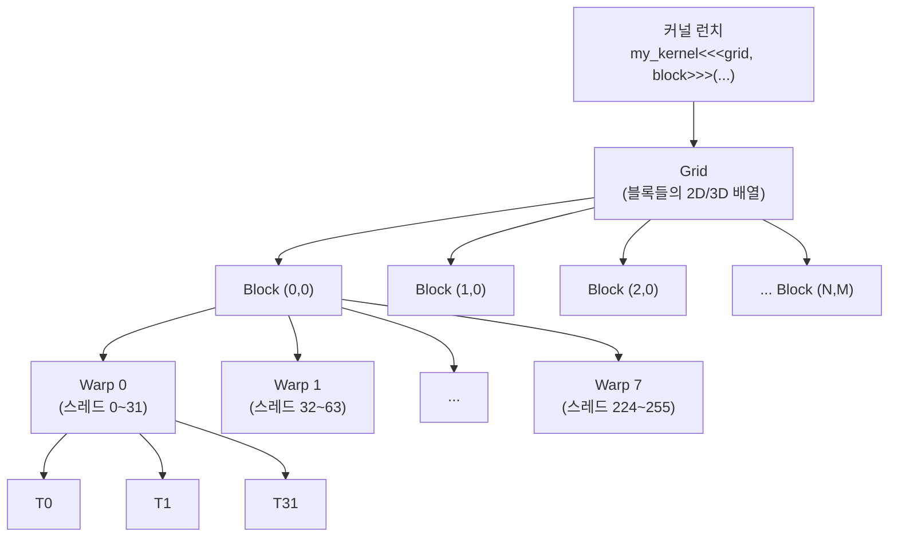
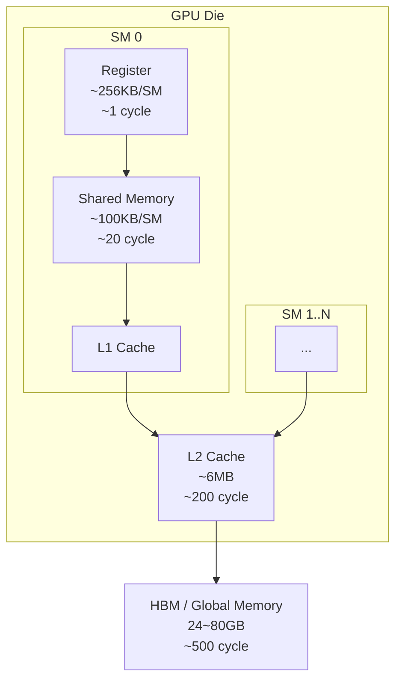
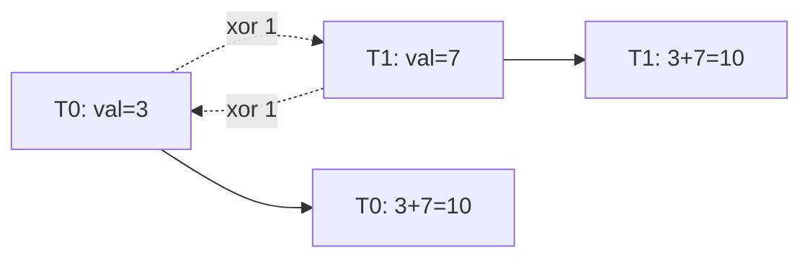

# 00 · CUDA 기초 개념 — 이후 모든 문서의 전제

> 이후 모든 커널 해설에서 **공유 메모리(shared memory), 워프 셔플(warp shuffle), 합체 접근(coalesced access), 뱅크 충돌(bank conflict)** 등의 단어가 자주 등장합니다. 이 문서에서 그 기반 개념을 한 번에 정리합니다.

---

## 1. 실행 계층 — Grid, Block, Thread, Warp

CUDA 커널을 실행할 때 우리는 `<<<grid, block>>>` 문법으로 **얼마나 많은 스레드를 띄울지** 선언합니다. 이 스레드들은 3단계 계층으로 조직됩니다.



| 단위 | 크기 | 물리적 대응 | 동기화 범위 |
|------|------|-------------|-------------|
| **Thread** | 1개 | 스칼라 파이프라인 1슬롯 | 없음 (단일 실행 흐름) |
| **Warp** | 32 스레드 | SM 내 1개 워프 스케줄러가 발사 | **록스텝** (한 PC 공유) |
| **Block** | ≤ 1024 스레드 | 1개의 SM에 배치 | `__syncthreads()` |
| **Grid** | 블록 여러 개 | 여러 SM 분산 | 기본 동기화 없음 (`__threadfence` / cooperative groups) |

### 스레드 인덱스 계산 표준 공식

```cuda
int idx = blockIdx.x * blockDim.x + threadIdx.x;
```

이 한 줄의 의미를 1D로 풀어 보면:

```
블록 크기 256이라고 가정

blockIdx.x = 0    blockIdx.x = 1    blockIdx.x = 2
┌──────────────┐ ┌──────────────┐ ┌──────────────┐
│ 0, 1, ..., 255│ │256,257,...,511│ │512,513,...,767│
└──────────────┘ └──────────────┘ └──────────────┘
      tid 0~255        tid 0~255        tid 0~255

idx = blockIdx.x * 256 + tid
    = 글로벌 배열 상의 위치
```

---

## 2. SIMT와 워프 — "32개가 한 몸처럼"

CUDA는 **SIMT** (Single Instruction, Multiple Thread) 모델입니다. 32개 스레드(1 워프)는 **같은 명령어**를 **같은 싸이클**에 실행합니다. 각 스레드는 고유한 레지스터와 인덱스를 갖지만 명령어 포인터(PC)는 공유합니다.

### 워프 다이버전스(divergence)

```cuda
if (threadIdx.x % 2 == 0) {
    a = heavy_work();    // 짝수 스레드만 실행
} else {
    b = other_work();    // 홀수 스레드만 실행
}
```

물리적으로는 이렇게 처리됩니다:

```
시간 ─────────────────────────────────────▶
워프 │ heavy_work() (홀수 마스크)  other_work() (짝수 마스크)
     │ ████████████████████░░░░░ ░░░░░░░░░░░░░░░░░░░░█████
                  ↑ 홀수는 NOP       ↑ 짝수는 NOP
     → 두 경로를 **직렬로** 실행 (성능 손실)
```

그래서 커널 작성 시 **같은 워프 안에서는 분기하지 않도록** 설계합니다.

---

## 3. 메모리 계층 — 왜 shared memory를 쓰는가



| 계층 | 용량 | 대역폭(대략) | 지연(싸이클) | 접근 범위 |
|------|------|-------------|------------|-----------|
| **Register** | 256 KB / SM | ∞ (on-chip) | 1 | 단일 스레드 |
| **Shared Memory** | 100 KB / SM (H100: 228KB) | ~19 TB/s | ~20 | 블록 내부 |
| **L1 Cache** | shared와 통합 | ~19 TB/s | ~20~30 | 블록 내부 |
| **L2 Cache** | 40~50 MB (H100) | ~7 TB/s | ~200 | 전체 GPU |
| **Global (HBM)** | 24~80 GB | ~2~3 TB/s | ~500 | 전체 GPU |

👉 **핵심**: 글로벌 메모리는 빠른 계산 유닛 대비 **100배 이상 느립니다**. 그래서 "한 번 읽어서 공유 메모리/레지스터에 재사용" — 이게 모든 고성능 CUDA 커널의 공통 전략입니다.

---

## 4. 합체 접근(Coalesced Access)

워프 내 32 스레드가 **연속된 128B 주소**를 읽으면 **1번의 트랜잭션**으로 처리됩니다. 이게 안 되면 최대 32번으로 쪼개집니다.

### ✅ 합체되는 패턴

```
스레드:   T0  T1  T2  T3  ...  T31
주소:    [0] [4] [8] [12] ... [124]      ← 4B × 32 = 128B 연속
         └─────────── 1 트랜잭션 ──────────┘
```

```cuda
int idx = blockIdx.x * blockDim.x + threadIdx.x;
float x = a[idx];  // ✅ 좋음
```

### ❌ 합체되지 않는 패턴

```cuda
float x = a[idx * stride];  // stride=4면 주소가 16B씩 점프 → 4개의 별도 트랜잭션
```

### 벡터화 로드 (`float4`) — 1 스레드가 16B를 한 번에

```cuda
float4 v = *reinterpret_cast<float4*>(&a[idx * 4]);
// → 32 스레드가 512B를 4 트랜잭션으로 읽음 (각 128B)
```

```
┌─ T0 ─┐┌─ T1 ─┐┌─ T2 ─┐       ┌─ T31 ─┐
│ 16 B ││ 16 B ││ 16 B │  ...  │  16 B │
└──────┘└──────┘└──────┘       └───────┘
  = 512 B (한 워프), 4 × 128B 합체 트랜잭션
```

이 기법이 [01-elementwise.md](./kernels/01-elementwise.md)의 `float4`, `HALF2`, `LDST128BITS` 매크로의 본질입니다.

---

## 5. Shared Memory 뱅크 충돌 (Bank Conflict)

공유 메모리는 **32개 뱅크**로 줄무늬처럼 분할됩니다.

```
주소(4B):  0    1    2    3    ...   31   32   33  ...
뱅크:     B0   B1   B2   B3   ...  B31   B0   B1  ...
          └─────── 라운드로빈 인터리브 ───────┘
```

### ✅ 워프 내 32 스레드가 서로 **다른 뱅크**를 접근 → 1싸이클

```
T0→B0  T1→B1  T2→B2 ... T31→B31   ✅
```

### ❌ 여러 스레드가 **같은 뱅크**를 접근 → 직렬화

전형적 예: 32×32 float 배열의 열 접근.

```
smem[tid][0]
  └─ T0:  addr=  0 → B0
  └─ T1:  addr= 32 → B0  ← 충돌!
  └─ T2:  addr= 64 → B0  ← 충돌!
  ...
  → 32-way conflict, 32 싸이클 소요
```

**해법 1: 패딩** (가장 흔함)

```cuda
__shared__ float smem[32][33];  // 한 칸 여분
```

한 행이 33 float = 33×4 = 132B이므로, 다음 행의 첫 원소는 뱅크 1로 시프트 → 충돌 없음.

**해법 2: Swizzle** (고성능, [12-swizzle.md](./kernels/12-swizzle.md) 참조)

XOR 기반 주소 변환으로 같은 총 용량을 유지하면서 충돌을 제거합니다.

---

## 6. 워프 셔플 (`__shfl_*_sync`)

워프 내 스레드끼리 **공유 메모리 경유 없이 레지스터를 직접 교환**하는 명령입니다. Reduce/Broadcast/Online Softmax의 핵심.



### `__shfl_xor_sync(mask, val, laneMask)`

`lane ^ laneMask` 위치의 스레드 값과 교환.

```
laneMask=16: lane 0 ↔ lane 16
             lane 1 ↔ lane 17
             ...

laneMask=8:  lane 0 ↔ lane 8, lane 1 ↔ lane 9, ...
laneMask=4:  lane 0 ↔ lane 4, ...
laneMask=2:  ...
laneMask=1:  lane 0 ↔ lane 1
```

### 워프 합 reduce 패턴

```cuda
for (int mask = 16; mask >= 1; mask >>= 1)
    val += __shfl_xor_sync(0xffffffff, val, mask);
// 5 step 후 모든 32 레인이 동일한 총합 보유
```

트리 구조:

```
초기:  [v0] [v1] [v2] [v3] [v4] [v5] [v6] [v7] ...  (32개)

step1 (xor 16):
  0↔16, 1↔17, ..., 15↔31    → 각 쌍의 합을 양쪽이 가짐
  [v0+v16] [v1+v17] ... [v15+v31] [v16+v0] ... [v31+v15]

step2 (xor 8):  0↔8, 1↔9, ...    → 이제 각 레인이 16개 합 보유
step3 (xor 4):                      → 24개 합
step4 (xor 2):                      → 28개 합
step5 (xor 1):                      → 32개 전체 합 (모든 레인에 복제됨)
```

---

## 7. 전형적인 2-단계 Block Reduce 패턴

```mermaid
flowchart TB
    A[블록 256 스레드<br/>각자 로컬 val] --> B[워프별 shfl_xor reduce<br/>→ 각 워프 lane 0이 결과 보유]
    B --> C[lane 0 8개가<br/>shared memory에 저장<br/>smem[warp_id] = val]
    C --> D[__syncthreads]
    D --> E[첫 워프가 smem 8개를 로드<br/>다시 shfl_xor reduce]
    E --> F[lane 0이 최종 결과]
```

이 패턴이 [03-reduce.md](./kernels/03-reduce.md), [05-softmax.md](./kernels/05-softmax.md), [06-layernorm.md](./kernels/06-layernorm.md) 전반에서 반복됩니다. 핵심은:

1. **워프 내부**는 `__shfl_xor_sync`로 통신 (빠름)
2. **워프 간**은 shared memory + `__syncthreads()`로 통신
3. 마지막 합산은 다시 **1개의 워프**만 담당 → shuffle로 마무리

---

## 8. 이후 문서에서 자주 등장하는 매크로

LeetCUDA 원본 코드가 공통으로 쓰는 매크로들:

```cuda
#define WARP_SIZE 32
#define FLOAT4(value)      (reinterpret_cast<float4*>(&(value))[0])
#define HALF2(value)       (reinterpret_cast<half2*>(&(value))[0])
#define LDST128BITS(value) (reinterpret_cast<float4*>(&(value))[0])
```

이들은 모두 **타입 재해석(reinterpret_cast) 트릭**으로 한 번에 128비트를 로드/스토어하기 위한 것입니다. 예를 들어:

```cuda
float4 v = FLOAT4(a[idx]);
// ≡ float4 v = *reinterpret_cast<float4*>(&a[idx]);
// → 16B(=128b) 1-issue load
```

`HALF2`는 fp16 2개(32b), `LDST128BITS`는 어떤 타입이든 float4 크기로 다뤄 128b 로드로 통일하는 매크로입니다.

---

## 9. Occupancy(점유율)의 직관

SM 하나에 **동시에 거주할 수 있는 워프 수** / **최대 가능 워프 수** = Occupancy.

- 블록당 **레지스터 사용량**이 많으면 → 블록 수 제한
- 블록당 **공유 메모리 사용량**이 많으면 → 블록 수 제한
- 블록당 **스레드 수**가 너무 작거나 너무 크면 → 스케줄링 손해

일반적으로 Occupancy가 높을수록 **메모리 지연을 다른 워프로 숨길 여유**가 커집니다. 하지만 Flash Attention 같은 커널은 오히려 **낮은 Occupancy로 큰 타일을 돌리는 것이 유리**할 수 있습니다 — 이 트레이드오프는 [11-flash-attn.md](./kernels/11-flash-attn.md)에서 다룹니다.

---

## 다음 문서

👉 [01-elementwise.md](./kernels/01-elementwise.md) — 가장 단순한 커널에서 **벡터화 로드 4가지 변형**을 비교하며 메모리 대역폭 포화 기법을 익힙니다.
