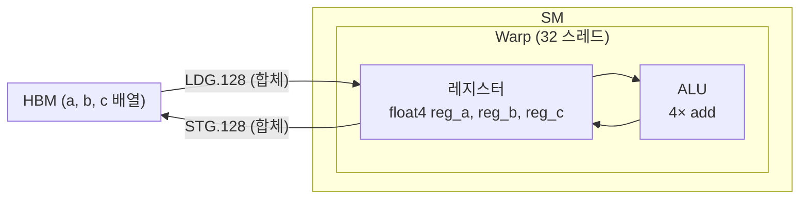

# 01 · Elementwise Add & 벡터화 로드

> 원본 파일: [`kernels/elementwise/elementwise.cu`](../../kernels/elementwise/elementwise.cu)
>
> **핵심 학습 포인트**: 같은 덧셈을 **4가지 방식**으로 구현하면서 "왜 벡터화 로드가 성능을 끌어올리는가"를 체감합니다.

---

## 1. 문제 정의

`c[i] = a[i] + b[i]`, `i = 0 … N−1`.

덧셈 자체는 1 FLOP/원소로 **연산량이 거의 없습니다**. 그래서 이 커널의 성능은 전적으로 **메모리 대역폭을 얼마나 포화시키는가**에 달려 있습니다.

```
한 원소당 필요한 바이트:  3 × sizeof(T)   (a 읽기 + b 읽기 + c 쓰기)
한 원소당 연산:           1 FLOP
산술 강도:                1 FLOP / (3 × 4B) = 0.083 FLOP/Byte  (FP32)
                         1 FLOP / (3 × 2B) = 0.167 FLOP/Byte  (FP16)
```

Roofline 모델 기준 **메모리 바운드**이므로 — 연산 최적화는 의미 없고, **DRAM에서 얼마나 빨리 읽어 오느냐**가 전부.

---

## 2. 4가지 변형 요약

| 커널 | 한 스레드당 처리 원소 | 한 스레드 로드 크기 | 한 워프(32 스레드) 트랜잭션 |
|------|----------------------|---------------------|----------------------------|
| `f32` (naïve) | 1 float | 4 B | 128 B × 2 (a, b) |
| `f32x4` | 4 float | **16 B** | **128 B × 2** ✅ 합체 |
| `f16` | 1 half | 2 B | 64 B (언더-사이즈) |
| `f16x2` | 2 half | 4 B | 128 B |
| `f16x8` | 8 half | 16 B | **512 B** 4-트랜잭션 |
| `f16x8_pack` | 8 half | 16 B (1 issue) | 128 B × 2, 레지스터 재배치 최적화 |

---

## 3. 변형 ①: FP32 스칼라 (Naïve)

`elementwise.cu:23-28`에 있는 가장 단순한 형태:

```cuda
int idx = blockIdx.x * blockDim.x + threadIdx.x;
if (idx < N) c[idx] = a[idx] + b[idx];
```

### 동작 다이어그램

```
block 0 (256 스레드)        block 1 (256 스레드)
┌──────────────────────────┐┌──────────────────────────┐
│T0 T1 T2 ... T31 T32... T255││T0 T1 ... T255           │
│ ↓  ↓  ↓      ↓             ↓                          │
│a[0] a[1] ... a[31]     → 1 트랜잭션 (128B)
│b[0] b[1] ... b[31]     → 1 트랜잭션 (128B)
│                           a[256]...                  │
└──────────────────────────┘└──────────────────────────┘
```

- **장점**: 이해하기 쉬움. 경계 처리(`idx < N`)가 단순.
- **단점**: 한 스레드가 4B(1 float)밖에 다루지 않아 **명령 오버헤드**가 크고, 트랜잭션 당 1 워프만 활용됨.

**실행 설정**: grid(N/256), block(256).

---

## 4. 변형 ②: FP32 × 4 벡터화 (`FLOAT4`)

`elementwise.cu:33-46`. 한 스레드가 **연속된 4개 float을 한 번에** 읽습니다.

```cuda
int idx = 4 * (blockIdx.x * blockDim.x + threadIdx.x);  // ★ 4배 점프
if (idx < N) {
    float4 reg_a = FLOAT4(a[idx]);     // 16B 단일 이슈 로드
    float4 reg_b = FLOAT4(b[idx]);
    float4 reg_c;
    reg_c.x = reg_a.x + reg_b.x;
    reg_c.y = reg_a.y + reg_b.y;
    reg_c.z = reg_a.z + reg_b.z;
    reg_c.w = reg_a.w + reg_b.w;
    FLOAT4(c[idx]) = reg_c;             // 16B 단일 이슈 스토어
}
```

### `FLOAT4` 매크로의 정체

```cuda
#define FLOAT4(value) (reinterpret_cast<float4*>(&(value))[0])
```

즉 `FLOAT4(a[idx])`는 `*(float4*)&a[idx]`와 동일. CUDA 하드웨어는 **16B 정렬된 `float4` 로드를 1 메모리 명령어**로 처리합니다.

### 왜 더 빠른가

```
[스칼라 버전]  ─── 32 스레드 × 4B = 128B 로드 ──── 1 트랜잭션
              └── 명령 발사 32번 ──────────────── 32 사이클 최소

[float4 버전]  ─── 32 스레드 × 16B = 512B 로드 ── 4 트랜잭션
              └── 명령 발사 32번 ──────────────── 32 사이클 최소
              ───▶ 같은 명령 횟수로 4배 데이터!
```

실제 SM 프론트엔드의 **명령 발사 대역폭**은 유한하기 때문에, 원소당 명령 수를 줄이는 것만으로도 상당한 이득을 봅니다.

### 경계 조건 함정

이 커널은 `N`이 4의 배수, 그리고 포인터가 16B 정렬이라고 **가정**합니다. 그렇지 않으면 `cudaErrorIllegalAddress` 가 납니다. 실제 딥러닝 텐서는 대부분 정렬돼 있지만, 일반화 시에는 마지막 꼬리 부분을 스칼라로 처리하는 **폴백 경로**가 필요합니다.

**실행 설정**: grid((N+255)/256), block(**256/4 = 64**). 같은 원소를 처리하지만 스레드는 1/4로 줄어듭니다.

---

## 5. 변형 ③: FP16 × 2 (`HALF2`)

FP16은 한 원소가 2B밖에 안 되므로, **스칼라 버전은 워프당 64B 트랜잭션**에 그칩니다 (합체가 안 되는 건 아니지만 한 사이클이 덜 효율적).

`elementwise.cu:58-68`:

```cuda
int idx = 2 * (blockIdx.x * blockDim.x + threadIdx.x);
half2 reg_a = HALF2(a[idx]);     // 4B 로드, fp16 2개를 묶은 구조체
half2 reg_b = HALF2(b[idx]);
half2 reg_c;
reg_c.x = __hadd(reg_a.x, reg_b.x);
reg_c.y = __hadd(reg_a.y, reg_b.y);
HALF2(c[idx]) = reg_c;
```

### `half2`의 중요성

`half2`는 32비트 레지스터 1개에 fp16 값 2개를 **패킹**합니다. `__hadd2`, `__hmul2` 같은 **SIMD within a register** 명령이 존재해서, 산술을 실제로 2개를 한 명령에 처리할 수도 있습니다 (아래 `x8_pack`에서 사용).

```
half2 레이아웃 (32-bit register):
┌──────────── 32 bits ────────────┐
│   half .y   │   half .x   │
│    16b       │    16b       │
└──────────────────────────────────┘
```

---

## 6. 변형 ④: FP16 × 8, 두 가지 구현

### 6-1. 비패킹 버전 (`f16x8_kernel`, `elementwise.cu:70-101`)

`half2`를 4번 로드해서 총 8개 fp16을 처리:

```cuda
int idx = 8 * (blockIdx.x * blockDim.x + threadIdx.x);
half2 reg_a_0 = HALF2(a[idx + 0]);   // 4B
half2 reg_a_1 = HALF2(a[idx + 2]);   // 4B
half2 reg_a_2 = HALF2(a[idx + 4]);   // 4B
half2 reg_a_3 = HALF2(a[idx + 6]);   // 4B
// ... b도 동일 ...
// 개별 덧셈 (SIMD 미사용)
reg_c_0.x = __hadd(reg_a_0.x, reg_b_0.x);
...
// 경계 체크가 4번 등장
if ((idx + 0) < N) HALF2(c[idx + 0]) = reg_c_0;
if ((idx + 2) < N) HALF2(c[idx + 2]) = reg_c_1;
...
```

컴파일러는 4개의 `LDG.E.U16x2` 명령어를 발사합니다. **단일 이슈**가 아닙니다.

### 6-2. 패킹 버전 (`f16x8_pack_kernel`, `elementwise.cu:103-125`)

`LDST128BITS` 매크로를 써서 **16B(=128b)를 한 번에** 읽습니다:

```cuda
half pack_a[8], pack_b[8], pack_c[8];   // 지역 배열 (레지스터 할당 기대)

LDST128BITS(pack_a[0]) = LDST128BITS(a[idx]);   // ★ 1 이슈 128b 로드
LDST128BITS(pack_b[0]) = LDST128BITS(b[idx]);   // ★ 1 이슈 128b 로드

#pragma unroll
for (int i = 0; i < 8; i += 2) {
    HALF2(pack_c[i]) = __hadd2(HALF2(pack_a[i]), HALF2(pack_b[i]));
    // ★ half2 × half2 = half2, 1 사이클 2개 덧셈
}

if ((idx + 7) < N) {
    LDST128BITS(c[idx]) = LDST128BITS(pack_c[0]);   // ★ 1 이슈 128b 스토어
} else {
    // 꼬리 스칼라 폴백
    for (int i = 0; idx + i < N; i++)
        c[idx + i] = __hadd(a[idx + i], b[idx + i]);
}
```

### 두 버전 비교

```
                    │ 로드 이슈 │ 스토어 이슈 │ 덧셈 │ 경계 체크
────────────────────┼───────────┼────────────┼──────┼──────────
f16x8   (비패킹)    │ 4 + 4     │ 4          │ 8    │ 4 조건문
f16x8_pack          │ 1 + 1 ★   │ 1 ★        │ 4 ★  │ 1 조건문 + fallback
```

`__hadd2`를 쓰면 실제 산술 명령 수도 절반으로 줄어듭니다.

### `LDST128BITS` 매크로의 트릭

```cuda
#define LDST128BITS(value) (reinterpret_cast<float4*>(&(value))[0])
```

`half pack_a[8]`의 메모리 레이아웃은 fp16 × 8 = 16B로 **float4와 동일한 크기**입니다. float4는 컴파일러가 128b 로드로 번역하므로, fp16 8개를 하나의 128b 트랜잭션으로 쥘 수 있습니다.

```
pack_a (로컬 배열):
  [h0][h1][h2][h3][h4][h5][h6][h7]  ← 각 2B, 총 16B
  └──────────── float4로 재해석 ────┘
                  ↓
            단일 128b 레지스터 쌍
```

---

## 7. Python 바인딩 매크로

`elementwise.cu:137-179`의 `TORCH_BINDING_ELEM_ADD` 매크로는 **변형 하나당 약 40줄의 래퍼 함수를 자동 생성**합니다. 라인별로 보면:

```cuda
#define TORCH_BINDING_ELEM_ADD(packed_type, th_type, element_type, n_elements) \
  void elementwise_add_##packed_type(torch::Tensor a, torch::Tensor b,         \
                                     torch::Tensor c) {                        \
    CHECK_TORCH_TENSOR_DTYPE(a, (th_type))                                     \
    ...                                                                         \
    const int ndim = a.dim();                                                  \
    if (ndim != 2) {                                                           \
      /* 1D/3D+ 경로: 총 원소 수로 계산 */                                       \
      ...                                                                       \
      dim3 block(256 / (n_elements));                                          \
      dim3 grid((N + 256 - 1) / 256);                                          \
      elementwise_add_##packed_type##_kernel<<<grid, block>>>(...);            \
    } else {                                                                    \
      /* 2D 경로: (S, K) shape 특화 */                                          \
      const int S = a.size(0);                                                 \
      const int K = a.size(1);                                                 \
      if ((K / (n_elements)) <= 1024) {                                        \
        /* K가 1024 이하면 행 전체를 1 블록에 */                                 \
        dim3 block(K / (n_elements));                                          \
        dim3 grid(S);                                                           \
      } else {                                                                  \
        /* 그 외엔 1D 경로로 폴백 */                                             \
      }                                                                         \
    }                                                                           \
  }
```

### `##`과 `#` 토큰 연산자

- `##`: 토큰 붙이기. `packed_type=f32x4` 이면 `elementwise_add_f32x4_kernel`로 확장.
- `#`: 문자열화. `STRINGFY(func)` → `"func"`. Python에서 호출할 때 쓸 함수 이름으로 사용.

`elementwise.cu:181-186`:

```cuda
TORCH_BINDING_ELEM_ADD(f32,         torch::kFloat32, float, 1)
TORCH_BINDING_ELEM_ADD(f32x4,       torch::kFloat32, float, 4)
TORCH_BINDING_ELEM_ADD(f16,         torch::kHalf,    half,  1)
TORCH_BINDING_ELEM_ADD(f16x2,       torch::kHalf,    half,  2)
TORCH_BINDING_ELEM_ADD(f16x8,       torch::kHalf,    half,  8)
TORCH_BINDING_ELEM_ADD(f16x8_pack,  torch::kHalf,    half,  8)
```

이 6줄이 6개 래퍼 함수를 생성하고, `PYBIND11_MODULE`에서 Python에 노출됩니다.

---

## 8. 요약 다이어그램: 메모리 파이프라인



`f32x4` / `f16x8_pack`가 달성하려는 그림입니다 — 메모리 이슈를 **최소 횟수의 128B 트랜잭션**으로 줄여 HBM 대역폭을 포화시키는 것.

---

## 9. 연습 제안

실제 GPU가 있다면:

1. `ncu --metrics dram__bytes.sum.per_second ./a.out` 로 대역폭 측정
2. `ncu --metrics smsp__inst_executed.sum` 로 이슈 횟수 비교
3. N을 크게(>1M) 잡아야 대역폭 한계에 도달

예상 경향: RTX 4090(1008 GB/s HBM) 기준 `f16x8_pack` 이 `f16` 대비 **1.5~2배** 빠를 것으로 알려져 있습니다 (LeetCUDA 원 README 수치 참고).

---

## 다음 문서

👉 [02-activations.md](./02-activations.md) — 같은 벡터화 기법을 ReLU/Sigmoid/GELU/Swish/ELU에 적용하되, `__expf`·`tanhf` 같은 초월함수의 **수치 안정성**과 **근사식**을 추가로 다룹니다.
