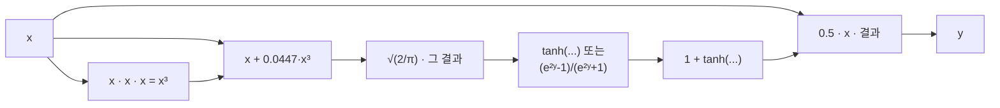

# 02 · 활성화 함수 — ReLU / Sigmoid / GELU / Swish / ELU

> 원본 파일:
> - [`kernels/relu/relu.cu`](../../kernels/relu/relu.cu)
> - [`kernels/sigmoid/sigmoid.cu`](../../kernels/sigmoid/sigmoid.cu)
> - [`kernels/gelu/gelu.cu`](../../kernels/gelu/gelu.cu)
> - [`kernels/swish/swish.cu`](../../kernels/swish/swish.cu)
> - [`kernels/elu/elu.cu`](../../kernels/elu/elu.cu)
>
> **핵심 학습 포인트**:
> 1. [01-elementwise](./01-elementwise.md)에서 배운 벡터화 로드는 모든 활성화에 그대로 적용됨.
> 2. 초월함수(exp, tanh)의 **수치 안정성 클램핑**과 **빠른 근사(intrinsics)**.

---

## 1. 활성화 함수들의 수식

| 함수 | 수식 | 특이점 |
|------|------|--------|
| ReLU | `y = max(0, x)` | 분기 없음, 초월함수 없음 → 가장 단순 |
| Sigmoid | `y = 1 / (1 + exp(-x))` | `exp(-x)`의 오버플로 위험 |
| Swish / SiLU | `y = x · sigmoid(x)` | 내부에 sigmoid 재사용 |
| GELU (tanh 근사) | `y = 0.5·x·(1 + tanh(√(2/π)·(x + 0.044715·x³)))` | tanh/exp 결합, 연산량 많음 |
| GELU (exact) | `y = 0.5·x·(1 + erf(x/√2))` | erf() 호출, 수치 정확도 ↑ |
| ELU | `y = x if x > 0 else α(eˣ − 1)` | 분기 + exp |

---

## 2. 공통 패턴

4가지 변형은 [01-elementwise](./01-elementwise.md)와 **완전히 동일한 구조**입니다:

```
f32       → 1 스레드 = 1 원소
f32x4     → 1 스레드 = 4 원소, FLOAT4 로드
f16       → 1 스레드 = 1 원소
f16x2     → 1 스레드 = 2 원소, HALF2 + half2 SIMD
f16x8     → 1 스레드 = 8 원소, HALF2 × 4번
f16x8_pack → 1 스레드 = 8 원소, LDST128BITS 1회 + half2 SIMD 4회
```

즉 "덧셈"을 "활성화"로 바꾸면 똑같은 골격입니다. 차이는 **수학 함수 호출**과 **수치 안정성**에서 발생합니다.

---

## 3. ReLU — 가장 단순한 경우

`relu.cu:21-25`의 핵심:

```cuda
if (idx < N) y[idx] = fmaxf(0.0f, x[idx]);
```

`fmaxf`는 IEEE 754 호환 최댓값 함수. **분기가 없음**이 중요합니다 — 만약

```cuda
y[idx] = (x[idx] > 0) ? x[idx] : 0;  // ❌ 다이버전스 유발
```

로 썼다면 워프 내에서 양수/음수가 섞이는 순간 실행 경로가 갈라져 성능이 떨어졌을 겁니다. `fmaxf`는 하드웨어 명령 `FMAX.F32` 하나로 컴파일되어 **무분기**.

### fp16 버전의 `__hmax`

`relu.cu:43-47`:

```cuda
y[idx] = __hmax(__float2half(0.0f), x[idx]);
```

`__hmax`는 `HMAX.F16` PTX 명령에 매핑됩니다. `half2 SIMD`로 묶으면 `HMAX2.F16x2` — 2개를 한 사이클에.

### Mermaid: ReLU의 데이터 흐름


---

## 4. Sigmoid — 오버플로 클램핑

`sigmoid.cu:19-22`에 정의된 매크로:

```cuda
#define MAX_EXP_F32  88.3762626647949f     // ln(FLT_MAX) 근처
#define MIN_EXP_F32 -88.3762626647949f
#define MAX_EXP_F16 __float2half(11.089f)  // ln(HALF_MAX)
#define MIN_EXP_F16 __float2half(-9.704f)
```

### 왜 이 범위인가

```
FP32: 최대값 ≈ 3.4×10³⁸ = e^88.38
      최소양수 ≈ 1.4×10⁻³⁸ = e^-88.72

FP16: 최대값 = 65504 = e^11.09
      최소양수 ≈ 6.1×10⁻⁵ = e^-9.70
```

이 범위를 벗어나면 **`expf`가 inf/0을 반환**하고, 이후 `1/(1+inf) = 0`, `1/(1+0) = 1`이 되어 **gradient flow가 끊깁니다**. 학습 중에는 큰 문제.

`sigmoid.cu:27-33`의 구현:

```cuda
float v = x[idx];
v = fminf(fmaxf(v, MIN_EXP_F32), MAX_EXP_F32);   // ← 클램프
y[idx] = 1.0f / (1.0f + expf(-v));
```

### 수치 시각화

```
v 원값:    -200 ────── -88.4 ──── 0 ──── +88.4 ────── +200
             │           │        │        │            │
클램프 후:  -88.4      -88.4      0      +88.4        +88.4
             │                                          │
σ(-88.4) = 1/(1+e^88.4) ≈ 0     σ(+88.4) = 1/(1+e^-88.4) ≈ 1
    ✅ 유한값 보존, gradient 0 ≠ NaN
```

### FP32 vs FP16 클램프 값 비고

FP16은 지수 범위가 매우 좁아 클램프가 훨씬 빨리 발동. 그래서 학습 시 **mixed precision**을 쓰면 내부 누산은 FP32로 빼는 것이 일반적.

### `expf`의 성능

`expf`는 내부적으로 `EX2.APPROX.F32` PTX로 구현됩니다 (`__expf` 인트린식은 동일). 일반 CRT `exp`보다 빠른 대신 **ULP(단위 마지막 자리)** 정확도가 낮습니다. 추론에서는 충분하지만, 고정밀 학습용이면 `exp` 사용.

---

## 5. Swish / SiLU

Swish = `x · σ(x)`. sigmoid 구현을 그대로 재사용:

```cuda
float sig_v = 1.0f / (1.0f + expf(-v));
y[idx] = v * sig_v;
```

연산량: sigmoid + 곱셈 1번. 비용 거의 동일.

---

## 6. GELU — 가장 복잡한 경우

GELU는 **두 근사식**이 표준입니다:

### 6-1. tanh 근사 (더 빠름, PyTorch 기본)

```
GELU(x) ≈ 0.5·x·(1 + tanh(√(2/π)·(x + 0.044715·x³)))
```

`gelu.cu:52-54`:

```cuda
return 0.5f * x * (1.0f + tanhf(SQRT_2_PI * (x + 0.044715f * x * x * x)));
```

`SQRT_2_PI` 상수는 `gelu.cu:23`에서 `M_SQRT2 * M_2_SQRTPI * 0.5f` = √2 · (2/√π) · 0.5 = **√(2/π) ≈ 0.7978845608** 로 정의.

### 6-2. erf 근사 (정확)

```
GELU(x) = 0.5·x·(1 + erf(x/√2))
```

`gelu.cu:56-58`:

```cuda
return x * 0.5 * (1 + erff(x * M_SQRT1_2));
```

`erff`는 CUDA math의 내장 함수. tanh 근사보다 **더 느리지만 정확**.

### FP16 GELU의 특수 사정

`gelu.cu:42-50`:

```cuda
__inline__ __device__ half gelu_tanh_approximate(half x) {
  half x_cube = x * x * x;
  half inner = HALF_SQRT_2_PI * (x + HALF_V_APP * x_cube);
  // tanh(y) = (e^(2y) - 1) / (e^(2y) + 1) 항등식
  return HALF_DIV2 * x *
         (HALF_1 +
          ((hexp(inner * HALF_2) - HALF_1) /
           (hexp(inner * HALF_2) + HALF_1)));
}
```

주석에 있듯 **CUDA 반정밀도에는 `tanh` 인트린식이 없습니다**. 그래서 수학 항등식으로 풀어냅니다:

$$
\tanh(y) = \frac{e^{2y} - 1}{e^{2y} + 1}
$$

대신 `hexp`(fp16 exp)를 **두 번 호출**합니다 (사실 같은 값을 두 번 계산 — 컴파일러가 CSE로 합치길 기대). 더 정확한 구현은 `__float2half(tanhf(__half2float(x)))`로 왕복 변환하는 것이지만, 캐스팅 비용이 더 크면 오히려 손해입니다.

### GELU 계산 파이프라인



연산 그래프가 길어 **레지스터 사용량**이 늘어납니다. 큰 블록 크기를 쓰면 occupancy가 떨어질 수 있음.

---

## 7. ELU

```
ELU(x) = x              if x ≥ 0
       = α(eˣ − 1)      if x < 0       (보통 α = 1)
```

분기가 있지만 `fmax`/`fmin` 트릭으론 제거가 불가능 (음수 영역만 변환이 필요). 대신 **predicated mov**로 컴파일됩니다:

```cuda
float v = x[idx];
float ev = expf(v) - 1.0f;
y[idx] = (v >= 0) ? v : alpha * ev;
```

컴파일러는 이를 `SEL.F32` (select) 로 변환해 분기 없이 처리합니다. 문제는 **`expf`는 항상 호출**된다는 점 — `v >= 0`인 스레드는 계산해 놓고 버립니다. 활성화 대부분이 양수라면 낭비지만, 워프 다이버전스를 피하는 대가로 수용합니다.

---

## 8. 비교: 각 활성화의 상대 비용

ALU 명령 수 대략치 (FP32 기준):

| 활성화 | 핵심 명령 | 상대 비용 |
|--------|-----------|----------|
| ReLU | `FMAX` | 1× |
| ELU | `EX2.APPROX` + `FMUL` + `SEL` | ~15× |
| Sigmoid | `EX2.APPROX` + `FADD` + `FRCP` | ~20× |
| Swish | Sigmoid + `FMUL` | ~21× |
| GELU (tanh) | `FMUL×4` + `EX2` × 2 + `FADD` + `FRCP` | ~40× |
| GELU (erf) | `erff` 내장 | ~35× |

**결론**: 메모리 바운드인 덧셈과 달리 GELU는 **연산도 무시 못 할 비용**. 그래도 전체는 여전히 메모리가 지배적이지만, FP16으로 내려가면 연산 비중이 눈에 띄게 올라옵니다.

---

## 9. 왜 이렇게 변형이 많은가 — 학습 포인트

| 변형 | 가르치는 것 |
|------|-------------|
| `f32` | 기본 커널 틀 |
| `f32x4` | `float4` 벡터화 (01과 동일) |
| `f16` | fp16 intrinsics (`__hadd`, `__hmax`, `hexp`) |
| `f16x2` | `half2` SIMD |
| `f16x8` | naïve half2 × 4 |
| `f16x8_pack` | `LDST128BITS` + unroll로 **이상적 로드/스토어** |

마지막 `_pack` 변형이 **모든 교훈의 집약**. 이 구조를 다음 reduce/softmax/gemm에서도 계속 재사용합니다.

---

## 다음 문서

👉 [03-reduce.md](./03-reduce.md) — **워프 셔플**과 **블록 리듀스**. 단일 스레드가 독립적이던 elementwise와 달리, 이제 **32 스레드가 협력**해 합을 구합니다.
