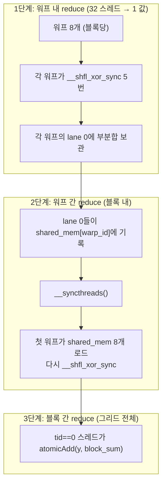

# 03 · Block All-Reduce — Warp Shuffle 트리

> 원본 파일: [`kernels/reduce/block_all_reduce.cu`](../../kernels/reduce/block_all_reduce.cu)
>
> **핵심 학습 포인트**:
> 1. **워프 셔플(`__shfl_xor_sync`)**로 공유 메모리 없이 32개 값을 합산.
> 2. **2단계 reduce**: (워프 내부 → 공유 메모리 → 첫 워프가 마무리).
> 3. fp16 누산의 수치 문제와 **"fp16 저장, fp32 누산" 규칙**.

---

## 1. 문제 정의

배열 `a[0..N-1]`의 합 `y = Σ a[i]` 을 구합니다. 모든 원소를 **한 스칼라로 축소**(reduce)하는 가장 기초적인 커널.

난이도가 갑자기 오르는 이유: 이전 elementwise/activation은 **스레드가 서로 독립**이었지만, reduce는 **스레드 간 통신**이 필수입니다.

---

## 2. 전체 알고리즘 — 3단 구조



---

## 3. 워프 내 reduce — `warp_reduce_sum_f32`

`block_all_reduce.cu:22-29`:

```cuda
template <const int kWarpSize = WARP_SIZE>
__device__ __forceinline__ float warp_reduce_sum_f32(float val) {
#pragma unroll
  for (int mask = kWarpSize >> 1; mask >= 1; mask >>= 1) {
    val += __shfl_xor_sync(0xffffffff, val, mask);
  }
  return val;
}
```

### `__shfl_xor_sync`의 동작

`lane ^ mask` 위치의 스레드가 갖고 있는 `val`을 **되돌려 받습니다**. 양쪽이 동시에 교환하므로, 더한 결과를 쓰면 **두 스레드가 같은 합을 공유**하게 됩니다.

### 5단계 이진 트리

```
step 1: mask=16
  T0 ←→ T16   T1 ←→ T17  ...  T15 ←→ T31
  (0..15)와 (16..31) 짝을 맺어 각자 16개 쌍의 합을 양쪽이 가짐

  T0 값:  a[0] + a[16]           T1:  a[1]+a[17]   ...
  T16 값: a[16] + a[0]           T17: a[17]+a[1]   ...

step 2: mask=8
  T0 ←→ T8   T1 ←→ T9   ...
  이제 T0 = a[0]+a[8]+a[16]+a[24]

step 3: mask=4
step 4: mask=2
step 5: mask=1

최종: 모든 32 레인이 동일한 전체 합을 보유 ★
```

### 나비(butterfly) 패턴 시각화

```
          step1          step2          step3         step4         step5
T0  ━━━━━┓  ┏━━━━━┓  ┏━━━┓ ┏━━━━┓   ┏━┓ ┏━━┓      ┏━┓┏━┓
T1  ━━━━━┫  ┃     ┃  ┃   ┗━┛    ┃   ┃ ┗━┛  ┃      ┃ ┗┛ ┃
T2  ━━━━━┫  ┃  ┏━━┻━━┓            ...
...        XOR 거리가 16, 8, 4, 2, 1 로 줄어들며 완전이진트리 구성

각 스레드의 최종 val = Σ all 32 lanes
```

### 마스크 `0xffffffff`

32비트 마스크. 각 비트 = 해당 레인 활성. `0xffffffff`는 **워프 전원 참여**. 다이버전스가 있다면 활성 레인만 포함해야 deadlock이 없습니다.

### 왜 공유 메모리보다 빠른가

```
공유 메모리 reduce:  write → __syncthreads() → read → sync → write → sync → ...
                     매 단계마다 SMEM 왕복 (20+ 사이클)

Warp shuffle reduce: 레지스터 ↔ 레지스터 직접 전송, 4~6 사이클
                     추가로 __syncthreads() 불필요 (워프는 이미 록스텝)
```

`__shfl_*` 명령은 **컴파일러가 SHFL.IDX/BFLY PTX 명령**으로 직접 내려서, 워프 스케줄러 레벨에서 레지스터 파일 포트를 공유합니다. 공유 메모리 경유가 필요 없어 **수 배 빠름**.

---

## 4. 블록 내 reduce — `block_all_reduce_sum_f32_f32_kernel`

`block_all_reduce.cu:34-56`:

```cuda
template <const int NUM_THREADS = 256>
__global__ void block_all_reduce_sum_f32_f32_kernel(float *a, float *y, int N) {
  int tid = threadIdx.x;
  int idx = blockIdx.x * NUM_THREADS + tid;
  constexpr int NUM_WARPS = (NUM_THREADS + WARP_SIZE - 1) / WARP_SIZE;  // 256/32 = 8
  __shared__ float reduce_smem[NUM_WARPS];                              // float[8]

  // 1. 각 스레드가 로컬 값 보관
  float sum = (idx < N) ? a[idx] : 0.0f;

  int warp = tid / WARP_SIZE;   // 0..7
  int lane = tid % WARP_SIZE;   // 0..31

  // 2. 워프 내 reduce
  sum = warp_reduce_sum_f32<WARP_SIZE>(sum);

  // 3. 각 워프의 lane 0만 shared memory에 기록
  if (lane == 0) reduce_smem[warp] = sum;
  __syncthreads();

  // 4. 첫 워프가 shared memory 8개 값 로드
  sum = (lane < NUM_WARPS) ? reduce_smem[lane] : 0.0f;

  // 5. 첫 워프에서 다시 shuffle reduce (8개만 처리)
  if (warp == 0) sum = warp_reduce_sum_f32<NUM_WARPS>(sum);  // NUM_WARPS=8

  // 6. 스레드 0만이 결과를 전역 atomic으로 누적
  if (tid == 0) atomicAdd(y, sum);
}
```

### 단계별 스레드 활용도

```
스레드:    0    1    2  ...   31   32  ...  223  224 ... 255
          └── 워프 0 ─────┘  └── 워프 1 ─┘     └── 워프 7 ──┘

1단계 (워프 reduce):
  ALL 256 스레드가 각자 __shfl_xor 참여

2단계 (lane==0 저장):
  T0, T32, T64, ..., T224   (8개만)    → SMEM

3단계 (__syncthreads):
  256 전원 배리어

4단계 (첫 워프만 reduce):
  T0..T7만 유효한 값 (SMEM 8개 로드)
  T8..T31은 0.0 보유 (덧셈에 영향 없음)
  T32..T255는 `if (warp==0)` 조건 미충족 → 건너뜀

5단계 (atomicAdd):
  T0만 atomicAdd(y, sum)
```

### 왜 4단계에서 `lane < NUM_WARPS` 체크?

`NUM_WARPS = 8` 이지만 첫 워프는 32개 레인. SMEM은 8 원소만 있으므로, 나머지 24개 레인은 **가비지 값 읽기를 방지**하기 위해 0.0으로 초기화. 그 상태로 `warp_reduce_sum_f32<8>`를 돌려도 0 + 유효값 = 유효값이라 안전.

### 왜 `atomicAdd`가 필요한가

한 블록이 구한 부분합은 `sum` 하나. 여러 블록이 동시에 `y`에 쓰므로 **경쟁 조건** 방지용 atomic이 필수. 다만:

- atomicAdd는 느립니다 (L2 serialize).
- `y`를 **호출 전에 0으로 초기화**해야 함 (`cudaMemset`).
- float atomic은 Pascal+ 에서 하드웨어 지원.

### 대안: 두 단계 런치

```
1회 런치: grid 블록마다 부분합 계산 → partial[blockIdx] 저장
2회 런치: partial 배열(수백~수천 원소) 다시 한 번 reduce
```

이 구조가 대규모에서는 더 빠를 수 있지만, 코드가 길어져 본 예제는 atomic 버전 유지.

---

## 5. float4 버전 — `block_all_reduce_sum_f32x4_f32_kernel`

`block_all_reduce.cu:61-86`:

```cuda
int idx = (blockIdx.x * NUM_THREADS + tid) * 4;

float4 reg_a = FLOAT4(a[idx]);
// 스레드 로컬에서 4개를 먼저 합산
float sum = (idx < N) ? (reg_a.x + reg_a.y + reg_a.z + reg_a.w) : 0.0f;

// 이후는 f32 버전과 동일
sum = warp_reduce_sum_f32<WARP_SIZE>(sum);
...
```

### 핵심 아이디어

- 한 스레드가 **4개 값을 먼저 ALU에서 합**한 다음, 원래의 1값 리듀스에 참여.
- 블록 크기는 64 스레드로 줄여도 같은 256 원소를 처리.
- **메모리 이슈 ↓**, **스레드 수 ↓**, 레지스터 압력 큰 변화 없음.

### 트레이드오프

블록당 스레드를 줄이면 **occupancy**가 떨어질 수 있음. 이 커널은 본질이 메모리 바운드라 크게 문제는 아니지만, 큰 reduce 뒤에 elementwise가 붙는 퓨전 커널에선 고려 필요.

---

## 6. FP16의 미묘한 문제 — 누산 정밀도

`block_all_reduce.cu:91-108`에 정의된 두 워프 reduce 헬퍼:

### 변종 A: fp16 누산 (`warp_reduce_sum_f16_f16`)

```cuda
__device__ __forceinline__ half warp_reduce_sum_f16_f16(half val) {
#pragma unroll
  for (int mask = kWarpSize >> 1; mask >= 1; mask >>= 1) {
    val = __hadd(val, __shfl_xor_sync(0xffffffff, val, mask));
  }
  return val;
}
```

→ **위험**: fp16 가수(mantissa)가 11비트. 수천 개 값을 누산하면 **마지막 비트들이 소실**되고 결과가 수 % 오차까지 틀어집니다.

### 변종 B: fp32 누산 (`warp_reduce_sum_f16_f32`)

```cuda
__device__ __forceinline__ float warp_reduce_sum_f16_f32(half val) {
  float val_f32 = __half2float(val);    // ← 먼저 fp32로 승격
#pragma unroll
  for (int mask = kWarpSize >> 1; mask >= 1; mask >>= 1) {
    val_f32 += __shfl_xor_sync(0xffffffff, val_f32, mask);
  }
  return val_f32;
}
```

→ **권장**: 글로벌 메모리/저장은 fp16, **내부 누산은 fp32**. 딥러닝 Mixed Precision 학습의 표준 레시피와 동일.

### 수치 비교 (개념)

```
1024 개의 ~1.0 값 합산

fp16 누산: 1024.0 근처에서 step size = 1.0 (fp16의 ulp ≈ 1/1024 at 1.0, 
           하지만 1024 부근에서는 ulp ≈ 1)
           → 추가되는 0.001 크기 값이 완전히 버려짐
           → 오차 수십 단위 가능

fp32 누산: 1024.0 근처 ulp ≈ 1.2e-4
           → 거의 정확
```

`block_all_reduce.cu:139-163`의 `f16_f32_kernel`이 이 교훈을 적용한 버전입니다.

---

## 7. FP16 × 2 버전

`block_all_reduce.cu:165-192`. 한 스레드가 `half2`로 2개씩 처리:

```cuda
half2 reg_a = HALF2(a[idx]);
half sum_f16 = (idx < N) ? __hadd(reg_a.x, reg_a.y) : __float2half(0.0f);
float sum_f32 = warp_reduce_sum_f16_f32<WARP_SIZE>(sum_f16);
```

`reg_a.x + reg_a.y`는 단일 fp16 덧셈. 이후 fp32로 승격 후 reduce → 누산 정밀도 유지.

### 더 빠른 변형: `__hadd2` 활용

실제로는 `half2` SIMD `__hadd2`를 써서 **두 값을 한 사이클에 누산**하고 마지막에만 스칼라로 빼는 방식도 가능. 파일 뒤쪽에 `f16x8` 변형이 존재.

---

## 8. 정리 — 블록 reduce의 "관용구"

이 구조는 다음 커널들에서 **거의 그대로** 재사용됩니다:

| 커널 | Reduce 대상 |
|------|-------------|
| Softmax | max, sum(exp) |
| LayerNorm | sum(x), sum(x²) |
| RMSNorm | sum(x²) |
| Dot Product | sum(a·b) |
| Flash Attention | 각 타일의 max, sum |

모두 `warp_reduce → lane==0 SMEM → __syncthreads → 첫 워프 reduce → atomicAdd(or 저장)` 패턴입니다.

---

## 9. 성능 팁

1. **`NUM_WARPS`를 32 이하로**: 첫 워프가 32 레인이니 최대 32 워프까지만 2단계 shuffle로 처리 가능. 블록당 1024 스레드 = 32 워프가 상한선.
2. **`atomicAdd` 접촉 최소화**: 가능하면 그리드당 1~2개 블록이 같은 주소에 몰리지 않게 설계.
3. **`grid-stride loop`**: N이 블록·스레드 수보다 훨씬 크면, 한 스레드가 루프 돌면서 여러 원소를 처리해 SMEM/레지스터 압력을 낮춤.

```cuda
// grid-stride 예시
float sum = 0;
for (int i = idx; i < N; i += gridDim.x * blockDim.x) sum += a[i];
// 이후 기존 block reduce
```

---

## 다음 문서

👉 [04-dot-histogram.md](./04-dot-histogram.md) — reduce의 응용. **내적(dot product)**은 elementwise 곱 + reduce의 합성. **히스토그램**은 서로 다른 버킷에 대한 atomic의 패턴을 다룹니다.
