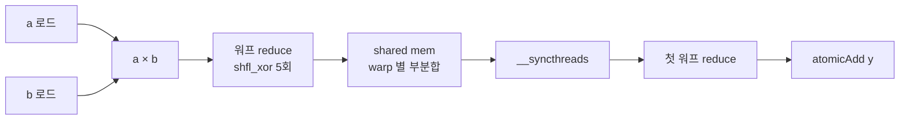

# 04 · Dot Product & Histogram

> 원본 파일:
> - [`kernels/dot-product/dot_product.cu`](../../kernels/dot-product/dot_product.cu)
> - [`kernels/histogram/histogram.cu`](../../kernels/histogram/histogram.cu)
>
> **핵심 학습 포인트**:
> 1. Dot product = elementwise 곱 + reduce의 **완벽한 퓨전**.
> 2. Histogram의 atomic 충돌 문제와 완화 기법.

---

## 1. Dot Product — Reduce의 가장 단순한 응용

`y = Σ a[i] · b[i]`

구조적으로 [03-reduce](./03-reduce.md)와 **거의 동일**합니다. 다른 점은 **한 스레드가 local에서 곱셈을 먼저 수행**한다는 점뿐.

### 핵심 라인 (`dot_product.cu:42`)

```cuda
float prod = (idx < N) ? a[idx] * b[idx] : 0.0f;  // ← 로컬 곱
// 이후 warp_reduce_sum → SMEM → 첫 워프 reduce → atomicAdd
```

**Reduce 패턴이 이렇게 재사용된다는 것 자체**가 교훈입니다. 한 번 이 뼈대를 익히면 softmax/layernorm/attention 모두 변주일 뿐.

### 데이터 흐름



### float4 버전 (`dot_product.cu:63-80`)

```cuda
float4 reg_a = FLOAT4(a[idx]);
float4 reg_b = FLOAT4(b[idx]);
float prod = reg_a.x*reg_b.x + reg_a.y*reg_b.y +
             reg_a.z*reg_b.z + reg_a.w*reg_b.w;
```

ALU 관점: 4번의 **FFMA** (Fused Multiply-Add) 명령 → 1 스레드당 4 FLOP. 이 시점에서도 여전히 메모리 바운드입니다 (a, b를 둘 다 읽어야 해서 바이트/FLOP 비율이 나쁨).

### 수치 안정성 주의

FP32 곱셈은 가수 24비트. 내적의 **카탈로그 오차**는 O(N·ulp). 매우 큰 N(>10⁶)이거나 값이 ill-conditioned 하면:

- **Kahan Summation** 권장
- 또는 **fp64 누산** (요즘 GPU는 fp64 throughput이 낮아 쓸 일 드물음)

본 예제는 단순 누산. 정확도가 우선이면 별도 구현이 필요합니다.

---

## 2. FP16 Dot Product의 변형들

원본 파일에 fp16/fp16x2/fp16x8 변형들이 있습니다. 모두 **"저장/로드는 fp16, 누산은 fp32"** 원칙을 따릅니다:

```cuda
half2 reg_a = HALF2(a[idx]);
half2 reg_b = HALF2(b[idx]);
// fp16 SIMD 곱
half2 reg_c = __hmul2(reg_a, reg_b);
// fp32로 승격 후 reduce
float prod = __half2float(reg_c.x) + __half2float(reg_c.y);
prod = warp_reduce_sum_f32<WARP_SIZE>(prod);
```

---

## 3. Histogram — 완전히 다른 난제

`y[bin]++` 를 모든 원소에 대해. **Reduce가 아니라 scatter + atomic**.

### Naïve 구현 (`histogram.cu:18-22`)

```cuda
int idx = blockIdx.x * blockDim.x + threadIdx.x;
if (idx < N) atomicAdd(&(y[a[idx]]), 1);
```

### 왜 느릴 수 있는가 — Atomic 충돌

```
a[] = [3, 3, 3, 3, 5, 5, 5, 3, ...]     ← 같은 bin이 연속되는 worst case
     │  │  │  │  │  │  │  │
     T0 T1 T2 T3 T4 T5 T6 T7 (서로 다른 스레드)
     │  │  │  │
     모두 y[3]에 atomicAdd
     → L2 cache line 경합 → 직렬화

시간 →
y[3]: T0 ──→ T1 ──→ T2 ──→ T3 (4 스레드가 순차적으로)
```

실제 자연 이미지 같은 데이터는 같은 bin에 여러 픽셀이 몰립니다(하늘 영역, 배경 등). 이 경우 **낙관적 throughput이 0.1× 로 주저앉는** 사례가 흔합니다.

### 완화 기법 1: **Privatized Histogram (SMEM)**

블록마다 SMEM에 로컬 히스토그램을 만들고, 마지막에 한 번만 글로벌 atomic:

```cuda
__shared__ int local_hist[NUM_BINS];   // 블록 전용 히스토그램

// 초기화
for (int b = tid; b < NUM_BINS; b += blockDim.x)
    local_hist[b] = 0;
__syncthreads();

// scatter to local
int idx = blockIdx.x * blockDim.x + tid;
if (idx < N) atomicAdd(&local_hist[a[idx]], 1);
__syncthreads();

// 블록 단위 기여를 글로벌에 합산
for (int b = tid; b < NUM_BINS; b += blockDim.x)
    atomicAdd(&y[b], local_hist[b]);
```

**효과**:

```
글로벌 atomic 경합:  N번 (예: 1M)
→ SMEM atomic (블록 내):  N번, 하지만 SMEM은 L2보다 **빠름**
글로벌 atomic (마지막):   (NUM_BINS × #blocks)번, 훨씬 적음
```

현재 `histogram.cu`는 이 최적화를 **적용하지 않은 기초 버전**입니다. 학습 목적이므로 단순한 편이 이해에 유리.

### 완화 기법 2: SMEM 뱅크 충돌 고려

`NUM_BINS=256`이라면 `local_hist[256]`은 인접한 bin이 같은 뱅크에 올 수 있어 atomic 충돌이 다른 형태로 발생. 보통은 그래도 글로벌 atomic보다 훨씬 빠름.

### 완화 기법 3: 워프당 복제(replication)

각 워프가 **별도의 히스토그램 복사본**을 갖고, 마지막에 합침. SMEM 사용량은 32배지만, atomic 경합은 1/32로 줄어듭니다. 큰 `NUM_BINS`에서는 메모리 비용이 커져 실용적이지 않음.

### histogram.cu의 vec4 버전

`histogram.cu:27-35`:

```cuda
int4 reg_a = INT4(a[idx]);              // 4개 정수 한 번에 로드
atomicAdd(&(y[reg_a.x]), 1);
atomicAdd(&(y[reg_a.y]), 1);
atomicAdd(&(y[reg_a.z]), 1);
atomicAdd(&(y[reg_a.w]), 1);
```

로드는 16B 합체됐지만 scatter(atomic 4개)는 여전히 **서로 다른 캐시라인**으로 갈 수 있어, 이것만으로는 병목 해결이 안 됨. **로드 효율**만 개선.

---

## 4. 비교: Reduce vs Histogram

| 측면 | Reduce (dot product) | Histogram |
|------|---------------------|-----------|
| 출력 크기 | 1 (스칼라) | NUM_BINS (수~수천) |
| 쓰기 패턴 | atomicAdd to 1 주소 | atomicAdd to a[i] 주소(산발) |
| 블록 간 경합 | 1개 주소에 모든 블록 | bin 분포 의존 |
| SMEM 활용 | warp 부분합 8개 | full histogram NUM_BINS |
| 벡터화 이득 | 합체 로드 + 로컬 합 | 합체 로드만 (쓰기는 분산) |

---

## 5. 실무 힌트

1. 히스토그램 최적화는 **입력 분포**에 크게 좌우됨. 랜덤 분포면 atomic 경합 적음, 편향된 분포(이미지 등)면 privatized 필수.
2. NVIDIA NPP, CUB 라이브러리에 잘 튜닝된 `DeviceHistogram`이 있음. 프로덕션에선 그쪽 사용.
3. 현 예제는 `a[i]`가 이미 bin index인 전제. 실제는 **연속값 → bin 매핑**이 추가로 필요하고, 이 매핑에서 분기가 또 문제.

---

## 다음 문서

👉 [05-softmax.md](./05-softmax.md) — Reduce 관용구가 **두 번** 쓰이는 문제(max, sum). 그리고 **Online Softmax**라는 매우 똑똑한 **1-pass** 알고리즘이 Flash Attention의 전조로 등장합니다.
