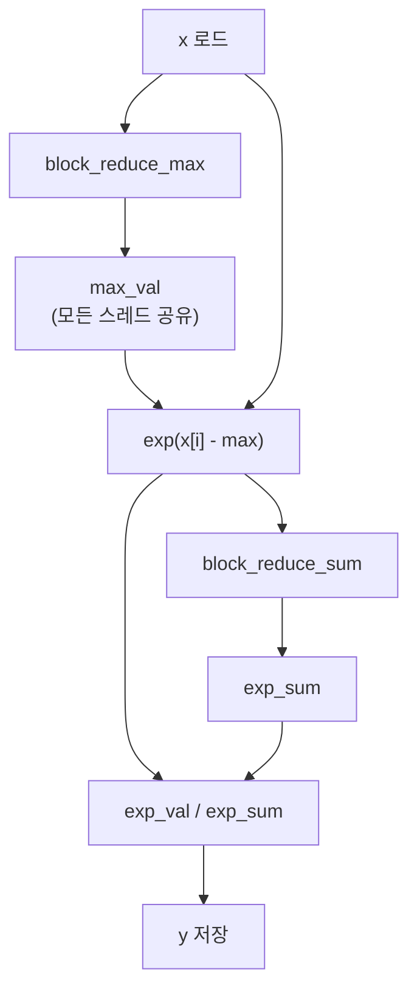

# 05 · Softmax — Naïve, Safe, Online의 3단계 진화

> 원본 파일: [`kernels/softmax/softmax.cu`](../../kernels/softmax/softmax.cu)
>
> **핵심 학습 포인트**:
> 1. Naïve softmax의 **오버플로** 문제.
> 2. **Safe softmax** = max 빼기 (2-pass: max 한 번, sum 한 번).
> 3. **Online softmax** = 1-pass, 병합 연산자. **Flash Attention**의 핵심 원리.

---

## 1. Softmax 복습

$$
\mathrm{softmax}(x)_i = \frac{e^{x_i}}{\sum_{j=1}^{N} e^{x_j}}
$$

정의대로 구현하면:

```cuda
// per-token softmax, 한 블록이 길이 N인 한 행 처리
float exp_val = expf(x[idx]);
float exp_sum = block_reduce_sum(exp_val);
y[idx] = exp_val / exp_sum;
```

**문제**: `x` 값이 크면 `expf(x)`가 **inf**가 됩니다. FP32 기준 `x > 88.7` 시 오버플로.

---

## 2. Naïve Softmax — `softmax_f32_per_token_kernel`

`softmax.cu:161-172`:

```cuda
template <const int NUM_THREADS = 256>
__global__ void softmax_f32_per_token_kernel(float *x, float *y, int N) {
  const int tid = threadIdx.x;
  const int idx = blockIdx.x * blockDim.x + tid;

  float exp_val = (idx < N) ? expf(x[idx]) : 0.0f;        // 1. exp
  float exp_sum = block_reduce_sum_f32<NUM_THREADS>(exp_val);  // 2. block sum
  if (idx < N) y[idx] = exp_val / exp_sum;                // 3. divide
}
```

### "per-token" 의미

Attention에서 softmax는 **각 쿼리 토큰마다** 길이 S(시퀀스)인 벡터에 적용됩니다. 즉 `x` shape = (B·H, S), 각 **행**을 독립적으로 처리.

- 런치 설정: `grid(B·H)`, `block(S)` (S ≤ 1024 가정).
- 한 블록 = 한 행 = 한 토큰.

### 이 커널의 두 가지 제약

1. **오버플로**: 위에서 설명.
2. **S ≤ block_size**: 한 블록이 한 행 전체를 처리하므로, 시퀀스 길이가 1024를 넘으면 불가.

---

## 3. Safe Softmax — max 빼기 트릭

수학적 항등식:

$$
\frac{e^{x_i}}{\sum_j e^{x_j}} = \frac{e^{x_i - m}}{\sum_j e^{x_j - m}}, \quad m = \max_j x_j
$$

`m`으로 모든 값을 이동하면 **최댓값이 0이 되어 `e^0 = 1`** 이 가장 큰 항. 오버플로 없음. 그리고 매우 작은 항은 **언더플로(0)**가 되지만, 합에 기여하지 않으므로 결과 무영향.

### 구현 (`softmax.cu:201-212`)

```cuda
__global__ void safe_softmax_f32_per_token_kernel(float *x, float *y, int N) {
  const int tid = threadIdx.x;
  const int idx = blockIdx.x * blockDim.x + tid;

  // ─── Pass 1: find max ───
  float val = (idx < N) ? x[idx] : -FLT_MAX;
  float max_val = block_reduce_max_f32<NUM_THREADS>(val);   // ★ max reduce

  // ─── Pass 2: find sum(exp) ───
  float exp_val = (idx < N) ? expf(x[idx] - max_val) : 0.0f;
  float exp_sum = block_reduce_sum_f32<NUM_THREADS>(exp_val);  // ★ sum reduce

  // ─── Normalize ───
  if (idx < N) y[idx] = exp_val / exp_sum;
}
```

### 2-pass 구조 시각화



### 비용

- Reduce 2회. 각각 `__syncthreads` 포함.
- `x`를 2번 읽는 것 같지만 실제로는 **레지스터에 남아 있어** DRAM 재접근은 없음 (컴파일러 최적화).
- 연산 증가: `fmax` × log2(N) 워프 레벨 × 2회.

### FP16 버전 — `safe_softmax_f16_f32_per_token_kernel`

`softmax.cu:250-261`에서 키 포인트:

```cuda
float val = (idx < N) ? __half2float(x[idx]) : -FLT_MAX;   // ★ fp16 → fp32
float max_val = block_reduce_max_f32<NUM_THREADS>(val);
float exp_val = (idx < N) ? expf(val - max_val) : 0.0f;    // fp32 exp
float exp_sum = block_reduce_sum_f32<NUM_THREADS>(exp_val);
y[idx] = __float2half_rn(exp_val / exp_sum);               // 저장만 fp16
```

핵심 규칙: **계산은 fp32, 메모리는 fp16**. `expf`를 fp16으로 하면 정밀도 문제 + FP16 지수 범위가 너무 좁음(±9.7).

---

## 4. Online Softmax — 1-pass 병합 법칙

논문: [Milakov & Gimelshein, 2018](https://arxiv.org/abs/1805.02867).

### 문제 의식

Safe softmax는 **입력을 2번 스캔**해야 함. 대형 시퀀스(S=64K 등)면:
- 1차: max 구하기. SMEM에 저장.
- 2차: exp(x−m) 합산.

**attention처럼 입력이 "한 타일씩 도착"하는 상황**에서는 2-pass가 불가능. 1-pass가 필요.

### 아이디어: `(m, d)` 페어를 **병합** 가능

현재까지 본 값들에 대해:
- `m`: 지금까지의 최댓값
- `d`: 지금까지의 `Σ e^(x_k − m)` (현재 max 기준으로 정규화된 합)

이 상태 `(m, d)`를 두 개 합치는 법을 알면, reduce 트리로 병렬화 가능.

### 병합 공식

서로 다른 상태 `(m_a, d_a)`와 `(m_b, d_b)`가 있을 때:

$$
m_{new} = \max(m_a, m_b)
$$

$$
d_{new} = d_a \cdot e^{m_a - m_{new}} + d_b \cdot e^{m_b - m_{new}}
$$

### 병합 증명 스케치

`(m_a, d_a)`는 "A 집합 원소들에 대해 `d_a = Σ_{A} e^{x − m_a}` 가 성립"을 의미. A ∪ B의 합을 새 max `m_new` 기준으로 다시 쓰면:

$$
\sum_{A \cup B} e^{x - m_{new}} = \sum_A e^{x - m_a} \cdot e^{m_a - m_{new}} + \sum_B e^{x - m_b} \cdot e^{m_b - m_{new}}
$$

`m_new ≥ m_a` 이므로 `e^{m_a - m_new} ≤ 1` — 수치적으로 안전.

### 병합 연산자 (`softmax.cu:27-44`)

```cuda
template <const int kWarpSize = WARP_SIZE>
__device__ __forceinline__ MD warp_reduce_md_op(MD value) {
  unsigned int mask = 0xffffffff;
#pragma unroll
  for (int stride = kWarpSize >> 1; stride >= 1; stride >>= 1) {
    MD other;
    other.m = __shfl_xor_sync(mask, value.m, stride);
    other.d = __shfl_xor_sync(mask, value.d, stride);

    // 큰 쪽의 max를 기준으로 병합
    bool value_bigger = (value.m > other.m);
    MD bigger_m  = value_bigger ? value : other;
    MD smaller_m = value_bigger ? other : value;

    // d_new = d_big + d_small · e^(m_small - m_big)
    value.d = bigger_m.d + smaller_m.d * __expf(smaller_m.m - bigger_m.m);
    value.m = bigger_m.m;
  }
  return value;
}
```

- `MD` 구조체 (`softmax.cu:22-25`):
  ```cuda
  struct __align__(8) MD {
    float m;
    float d;
  };
  ```
  — 8바이트 정렬로 1회 로드에 (m, d) 함께 읽도록 유도.

- 병합을 `__shfl_xor_sync` 위에서 수행하므로, **교환법칙**만 만족하면 되고 결과는 레인 순서와 무관. (실제로 이 연산은 교환/결합 법칙을 만족함 — 논문 증명 참조.)

### 병합 다이어그램

```
초기:
  T0  T1  T2  T3  ...  T31
  (m0,d0)  ... 각자 (xi, 1.0)

step 1 (mask=16):
  T0 ↔ T16:  (m_new, d_new) = merge((m0,d0), (m16,d16))
                                      max와 이동후 합산

  ...이진 트리로 5스텝 후 T0가 완전한 (m_block, d_block) 보유
```

### 코어 커널 — `online_safe_softmax_f32_per_token_kernel`

`softmax.cu:330-365`:

```cuda
MD val;
val.m = (global_tid < N) ? x[global_tid] : -FLT_MAX;
val.d = (global_tid < N) ? 1.0f : 0.0f;
// 각 스레드의 초기 상태: ({자기 값 하나}, 1.0)
// 즉 "1개 원소에 대한 (m, d)"

MD res = warp_reduce_md_op<WARP_SIZE>(val);  // 워프 내 병합 → 32개 상태 → 1 상태

if (lane_id == 0) shared[warp_id] = res;      // 워프별 대표를 SMEM에
__syncthreads();

if (local_tid < WARP_SIZE) {
  MD block_res = (local_tid < WARP_NUM)
                 ? shared[local_tid]
                 : MD{-FLT_MAX, 0.0f};         // 가드 (정체값)
  block_res = warp_reduce_md_op<WARP_NUM>(block_res);  // 워프 간 병합
  if (local_tid == 0) shared[0] = block_res;   // 최종 결과 저장
}
__syncthreads();

MD final_res = shared[0];
float d_total_inverse = __fdividef(1.0f, final_res.d);
if (global_tid < N)
  y[global_tid] = __expf(x[global_tid] - final_res.m) * d_total_inverse;
```

- **단 1회의 reduce**로 max와 sum(exp)를 동시에 계산.
- 이전 safe 버전 대비 **sync 횟수 절반**.

### 정체값(identity) `{-FLT_MAX, 0.0f}`

MD 연산의 단위원소. 병합 시 max는 `-FLT_MAX`이므로 항상 상대가 "큰 쪽"이 되고, `d = 0 + d_other · e^{m_other - m_other} = d_other` — 영향 없음.

---

## 5. float4 pack 버전 — `online_safe_softmax_f32x4_pack_per_token_kernel`

`softmax.cu:369-411`. 한 스레드가 4개 원소 처리:

```cuda
float4 val = FLOAT4(x[global_tid]);   // 16B 합체 로드
float local_m = fmaxf(fmaxf(val.x, val.y), fmaxf(val.z, val.w));
float local_d = __expf(val.x - local_m) + __expf(val.y - local_m) +
                __expf(val.z - local_m) + __expf(val.w - local_m);
MD local_md = {local_m, local_d};

// 이후 동일하게 warp / block 병합
```

- 각 스레드가 **자기 4개에 대한 (m, d)** 를 이미 "sub-merge" 해둔 상태에서 시작.
- 스레드 수는 1/4, 그러나 병합 연산은 이미 사전 계산됨 → 전체 연산량 동일, **메모리 이슈와 스레드 오버헤드만 감소**.

---

## 6. 이 문서의 핵심 — Flash Attention으로 가는 길

Online softmax의 **병합 법칙**이 왜 중요한가?

Attention 계산:
```
S = Q @ K^T              ← (Nq, Nk) 거대 행렬
P = softmax(S, dim=-1)   ← S를 메모리에 보관하지 않고 softmax?
O = P @ V
```

전통적 구현은 **S 전체를 HBM에 매터리얼라이즈**해야 해서 메모리 bound. Flash Attention의 아이디어:

1. **S의 타일씩 계산**하고 각 타일마다 **부분 (m, d, O_partial)** 유지.
2. 새 타일이 오면 **online softmax 병합**으로 누적.
3. S 전체를 저장할 필요 없음 → **O(N) 메모리**, 큰 시퀀스에 스케일.

이 뼈대가 바로 [11-flash-attn.md](./11-flash-attn.md)에서 다룰 내용이고, **핵심 수학은 이 문서에서 다 다뤘다**는 점이 중요합니다.

---

## 7. 성능 비교 (개념적)

```
                   Reduce수  Sync횟수  Pass수  오버플로?
naive softmax        1         1         1      ✗ (큰 값에서)
safe softmax         2         2         2      ✓
online softmax       1         2*        1      ✓
                     (warp+block 2단계 sync는 공통)

* 2번이라고 써도 실제는 max+sum을 한 reduce로 묶었으므로 낫다
```

FP32 per-token 기준 online 버전이 safe 버전보다 **~1.3~1.8× 빠름** (LeetCUDA README 벤치 참고).

---

## 8. 수치적 함정 2가지

**1) 모든 값이 −∞인 경우 (마스킹된 attention 끝부분)**
- `max = -FLT_MAX`, `exp(x - max) = exp(0) = 1`? 아니, `x = -FLT_MAX` 자체이므로 `x - max = 0`, `exp(0) = 1`, `sum = N`. 결과: 균등분포 `1/N`. 
- 실제 attention에선 보통 마스킹 토큰을 `-1e9`로 바꿔서 처리.

**2) 첫 워프 외 스레드의 쓰레기**
- `shared[0] = block_res`를 `local_tid == 0`만 쓰지만, 이후 **모든 스레드가 shared[0] 읽음**. 이 때문에 `__syncthreads()`가 필수.

---

## 다음 문서

👉 [06-layernorm.md](./06-layernorm.md) — 또 다른 **2-pass reduce**(평균, 분산)의 전형적 패턴. Welford 온라인 분산 알고리즘과 비교.
