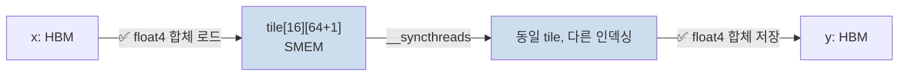

# 07 · Matrix Transpose & Bank Conflict 제거

> 원본 파일: [`kernels/mat-transpose/mat_transpose.cu`](../../kernels/mat-transpose/mat_transpose.cu)
>
> **핵심 학습 포인트**:
> 1. 전치는 **읽기 또는 쓰기 중 한 쪽이 반드시 비합체(uncoalesced)**라는 근본 문제.
> 2. 해결책: **공유 메모리 타일 경유**로 읽기/쓰기 모두 합체시키기.
> 3. 이때 생기는 **뱅크 충돌**을 `+ PAD` 패딩으로 제거.
> 4. 대각선 블록 스케줄링(diagonal)으로 **L2/HBM 파티션 충돌** 완화.

---

## 1. 문제의 본질

`y[j][i] = x[i][j]`.

행 우선(row-major) 저장일 때:
- `x[i][j]`는 메모리에서 `i*col + j`
- `y[j][i]`는 메모리에서 `j*row + i`

```
x 배열 (row-major):
  x[0][0] x[0][1] x[0][2] ... x[0][col-1]    ← 연속
  x[1][0] x[1][1] ...                         ← 다음 행, col 간격
  ...

x[i][j]를 워프 32개가 읽을 때:
  j가 변하면 (같은 행 내) → 연속 주소 → ✅ 합체
  i가 변하면 (같은 열 내) → col*4B 간격 점프 → ❌ 비합체
```

**전치의 딜레마**: 워프가 x의 한 행을 읽고 y의 한 열에 쓴다 → 읽기는 합체, **쓰기는 col 간격 점프 = 완전 비합체**. 반대도 마찬가지.

---

## 2. Naïve `col2row` vs `row2col`

`mat_transpose.cu:22-30`:

```cuda
// col2row: x[i][j] 읽고 y[j][i]에 씀
int global_idx = blockIdx.x * blockDim.x + threadIdx.x;
int global_row = global_idx / col;
int global_col = global_idx % col;
y[global_col * row + global_row] = x[global_idx];  // ★ 읽기 합체, 쓰기 비합체
```

`mat_transpose.cu:33-41`:

```cuda
// row2col: x[i][j] 읽고 y[j][i]에 씀 (반대 스윕)
y[global_idx] = x[global_row * col + global_col];  // ★ 읽기 비합체, 쓰기 합체
```

두 버전이 존재하는 이유: **어느 쪽이 빠른가?** GPU 아키텍처에 따라 다름.
- 쓰기 비합체는 write-combine buffer가 완화할 여지 있음.
- 읽기 비합체는 캐시 적중 시 완화 여지.
- 일반적으로 **둘 다 느림** — 그래서 SMEM 타일 버전으로 갑니다.

### float4 변형 (`mat_transpose.cu:43-74`)

`float4` 로 읽더라도, 쓰기는 여전히 4개를 **각각 다른 열에 scatter** 해야 하므로 비합체는 그대로.

```
x[i][j..j+3] 한 번에 float4 로드  ✅ 16B 합체
y[j][i], y[j+1][i], y[j+2][i], y[j+3][i]  ← 4개의 개별 4B 쓰기, 각각 row*4B 간격
```

이득: **읽기만** 개선.

---

## 3. Shared Memory 타일 전치 — 핵심 기법

`mat_transpose.cu:137-166`의 `mat_transpose_f32x4_shared_col2row2d_kernel`:

```cuda
__shared__ float tile[WARP_SIZE_S][WARP_SIZE_S * 4];
// WARP_SIZE_S=16 → tile[16][64] float

// 1단계: x → tile (두 축 모두 합체)
float4 x_val = reinterpret_cast<float4*>(x)[global_y * col/4 + global_x];
tile[local_y][local_x * 4 + 0] = x_val.x;
tile[local_y][local_x * 4 + 1] = x_val.y;
tile[local_y][local_x * 4 + 2] = x_val.z;
tile[local_y][local_x * 4 + 3] = x_val.w;
__syncthreads();

// 2단계: tile → y (SMEM 상에서 "전치 인덱싱"하여 읽고 합체 쓰기)
constexpr int STRIDE = WARP_SIZE_S / 4;  // = 4
float4 smem_val;
smem_val.x = tile[(local_y % STRIDE) * 4    ][local_x * 4 + local_y / STRIDE];
smem_val.y = tile[(local_y % STRIDE) * 4 + 1][local_x * 4 + local_y / STRIDE];
smem_val.z = tile[(local_y % STRIDE) * 4 + 2][local_x * 4 + local_y / STRIDE];
smem_val.w = tile[(local_y % STRIDE) * 4 + 3][local_x * 4 + local_y / STRIDE];
// ... y에 float4 쓰기
```

### 핵심 아이디어 시각화

```
x (global)                tile (shared memory)               y (global)
┌──────────────────┐      ┌──────────────────┐             ┌──────────────────┐
│ row 0: ● ● ● ● │ ──▶  │ row 0: ● ● ● ● │  tile에 x를    │ col 0: ● ● ● ● │
│ row 1: ● ● ● ● │      │ row 1: ● ● ● ● │  합체 로드     │ col 1: ● ● ● ● │
│ ...              │      │ ...              │  하고          │ ...              │
└──────────────────┘      └──────────────────┘  tile을       └──────────────────┘
     ✅ 합체 읽기              (블록 내부 저장)    "전치로" 읽고  ✅ 합체 쓰기
                                                  y에 씀
```

**두 번의 합체 접근**으로 전체를 처리. SMEM 접근이 추가되지만 SMEM은 DRAM보다 20배 이상 빠름 — 수지 맞음.

---

## 4. 뱅크 충돌 문제

그냥 `__shared__ float tile[16][64]`로 선언하면 SMEM 접근 시 **32-way 뱅크 충돌**이 발생합니다.

### 왜?

SMEM은 32개 뱅크로 4B 단위 인터리빙:
```
주소 offset(4B):  0   1   2   3 ...  31  32  33 ...
뱅크:            B0  B1  B2  B3 ... B31  B0  B1 ...
```

`tile[16][64]`의 한 행이 64 float = 256B. 다음 행의 시작 offset은 64. **64 mod 32 = 0** → 인접 두 행의 같은 열이 **같은 뱅크**!

```
tile[0][0]: B0
tile[1][0]: B0   ← 같은 뱅크! 두 스레드가 읽으면 직렬화
tile[2][0]: B0
...
```

### 2단계에서 뭐가 문제인가

2단계에서 `tile[row_idx][local_x * 4 + local_y / STRIDE]` 로 읽을 때, **32 스레드의 row_idx 값이 각각 다르고 col_idx는 같은** 경우가 많이 생깁니다. 이게 같은 뱅크를 32번 때리는 **32-way conflict**.

### 해결책: 패딩 `+ PAD`

`mat_transpose.cu:221`의 bcf(Bank Conflict Free) 커널:

```cuda
__shared__ float tile[WARP_SIZE_S][WARP_SIZE_S * 4 + PAD];  // PAD = 1
// tile[16][65]  ← 마지막 열 여분 1칸
```

### 왜 + 1로 해결되나

행 크기가 `64 + 1 = 65 float = 260B`. 다음 행의 시작 offset = 65. **65 mod 32 = 1**. 즉 다음 행이 **뱅크 1**부터 시작. 그 다음 행은 **뱅크 2**에서 시작. 즉 같은 열도 행마다 뱅크가 **다른 위치로 시프트**.

```
뱅크 배치 (패딩 후):
  tile[0][0..31]:   B0 B1 ... B31
  tile[0][32..63]:  B0 B1 ... B31
  tile[0][64]:      B0            ← 더미 한 칸
  tile[1][0..31]:   B1 B2 ... B0  ← ★ 1만큼 시프트됨
  tile[1][32..63]:  B1 B2 ... B0
  tile[1][64]:      B1
  ...
```

이제 `tile[0..15][0]` 접근 시 뱅크가 `B0, B1, B2, ..., B15` — 모두 다른 뱅크. ✅

**추가 SMEM 비용**: 16 × 1 × 4B = 64B. 미미.

### 패딩 없을 때 시각화

```
bank: 0  1  2  3  ...  31  0  1  2 ... 31    (뱅크가 32개마다 순환)

tile[0][0] ──▶ bank 0
tile[1][0] ──▶ bank 0  ← 충돌!
tile[2][0] ──▶ bank 0  ← 충돌!
...
32-way conflict: 32 사이클
```

### 패딩 후

```
tile[0][0] ──▶ bank 0
tile[1][0] ──▶ bank 1  ← 다른 뱅크 ✅
tile[2][0] ──▶ bank 2
...
no conflict: 1 사이클
```

---

## 5. Diagonal 블록 스케줄링

`mat_transpose.cu:77-86`:

```cuda
__global__ void mat_transpose_f32_diagonal2d_kernel(float *x, float *y,
                                                    int row, int col) {
  const int block_y = blockIdx.x;                            // ← x/y 뒤집힘
  const int block_x = (blockIdx.x + blockIdx.y) % gridDim.x; // ★ 대각선 매핑
  const int global_col = threadIdx.x + blockDim.x * block_x;
  const int global_row = threadIdx.y + blockDim.y * block_y;
  ...
}
```

### 문제 배경: Partition Camping

HBM은 여러 채널로 나뉘어 있고, 주소의 특정 비트가 **채널 선택**을 결정합니다. 전치 커널에서 **블록들이 선형 스케줄링되면 같은 시각에 여러 블록이 같은 채널**에 집중 쓰기를 시도해 **partition camping**이 발생.

### Diagonal 매핑의 의도

```
선형 스케줄:                  대각선 스케줄 (diagonal):
블록 (0,0) (1,0) (2,0)...       (0,0) (1,0) (2,0)...
블록 (0,1) (1,1) (2,1)...       (1,1) (2,1) (3,1)...
블록 (0,2) (1,2) (2,2)...       (2,2) (3,2) (0,2)...
  └─ y 좌표가 같은 블록들이        └─ 같은 시점의 블록들이
     같은 채널에 몰림                 서로 다른 채널로 분산
```

`block_x = (blockIdx.x + blockIdx.y) % gridDim.x` — 간단한 회전으로 대각선 패턴 달성.

### 제한

"work for row == col" 주석이 달려 있듯, 이 버전은 **정방행렬 전용**.

---

## 6. 변형별 요약표

| 커널 | 메모리 효율 | 뱅크 충돌 | 비고 |
|------|------------|----------|------|
| `col2row` (naïve) | 읽기 합체, 쓰기 비합체 | N/A | 기본선 |
| `row2col` (naïve) | 읽기 비합체, 쓰기 합체 | N/A | 대칭 |
| `f32x4_col2row` | vec 읽기만 최적화 | N/A | 부분 개선 |
| `shared col2row` | 양쪽 합체 | ❌ 존재 | SMEM 타일 도입 |
| `shared bcf` | 양쪽 합체 | ✅ 제거(+PAD) | **권장** |
| `diagonal` | 합체 + 채널 분산 | (N/A in 본 구현) | 정방 전용 |

---

## 7. Mermaid: 데이터 흐름



---

## 8. 확장: swizzle로 PAD 대체

PAD = 1은 단순하지만 **SMEM 용량이 조금 낭비**됩니다. 더 고급 기법은 **XOR swizzle**로 같은 용량을 유지하며 뱅크 충돌을 제거. 자세한 설명은 [12-swizzle.md](./12-swizzle.md) 참조.

간단히: `col ^ row`로 실제 SMEM 주소를 결정하면 행 간 뱅크가 자연스럽게 시프트됨 → 100% SMEM 활용.

---

## 9. 성능 경향 (참고)

| 변형 | A100 대역폭 활용 (예상) |
|------|------------------------|
| naïve col2row | ~20~30% |
| f32x4 col2row | ~35~45% |
| SMEM (no pad) | ~50% (뱅크 충돌 때문) |
| **SMEM + PAD** | **~85~95%** |
| diagonal + SMEM + PAD | ~90~100% |

실측은 원 LeetCUDA 벤치마크 참고. 본 작성자 환경에서는 측정 불가.

---

## 다음 문서

👉 [08-sgemm.md](./08-sgemm.md) — 전치에서 배운 **SMEM 타일**이 이제 **2D 타일 행렬 곱**으로 확장됩니다. 레지스터 블로킹까지 더해 본격적인 고성능 GEMM이 시작.
