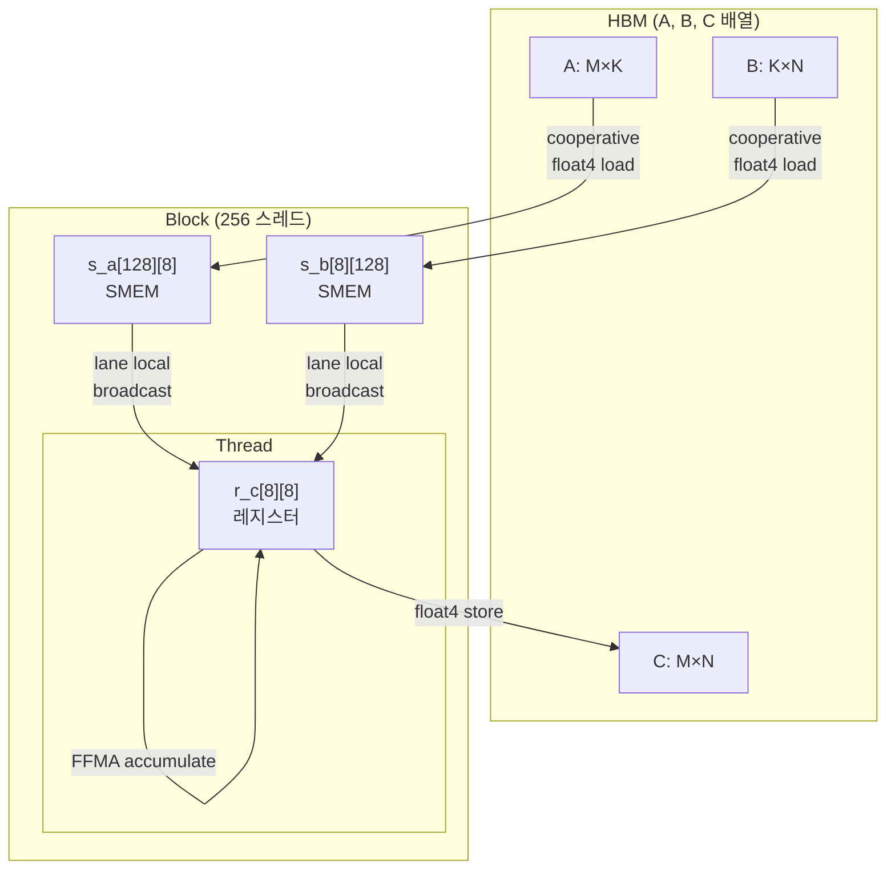

# 08 · SGEMM — 타일링 & 레지스터 블로킹

> 원본 파일: [`kernels/sgemm/sgemm.cu`](../../kernels/sgemm/sgemm.cu)
>
> **핵심 학습 포인트**:
> 1. **3단 메모리 계층 타일링**: Block tile → Warp/Thread tile → K tile.
> 2. **레지스터 블로킹** (각 스레드가 TM×TN=8×8=64 원소를 담당).
> 3. **산술 강도(arithmetic intensity)**를 높여 메모리 바운드 → 연산 바운드로 이동.
> 4. GEMM = 대부분의 딥러닝 연산의 근간. 최적화 난이도의 "교과서".

---

## 1. 문제 정의

$C_{M \times N} = A_{M \times K} \cdot B_{K \times N}$, row-major.

한 원소 `C[m][n]`의 계산:
$$
C[m][n] = \sum_{k=0}^{K-1} A[m][k] \cdot B[k][n]
$$

- **연산**: `M × N × K` 번의 FMA (= 2MNK FLOP).
- **메모리**: naïve로 `M·N·K` 번씩 A, B, C 접근. 사실 A는 M·K, B는 K·N, C는 M·N 바이트만 유일하므로, **재사용**이 핵심.

---

## 2. Naïve 버전 — `sgemm_naive_f32_kernel`

`sgemm.cu:21-35`:

```cuda
__global__ void sgemm_naive_f32_kernel(float *a, float *b, float *c,
                                       int M, int N, int K) {
  int n = blockIdx.x * blockDim.x + threadIdx.x;
  int m = blockIdx.y * blockDim.y + threadIdx.y;

  if (m < M && n < N) {
    float psum = 0.0;
    #pragma unroll
    for (int k = 0; k < K; k++) {
      psum += a[m * K + k] * b[k * N + n];   // ★ 매 k에서 DRAM 2회 로드
    }
    c[m * N + n] = psum;
  }
}
```

### 성능 분석

한 스레드가 `C[m][n]` 1개 계산을 위해:
- `a[m][0..K-1]` 읽기: K회 — 같은 워프 내 스레드들이 **같은 행**을 읽으므로 L2 재사용 있음.
- `b[0..K-1][n]` 읽기: K회 — 같은 워프 내 스레드들이 **같은 행의 다른 열**을 읽으므로 합체됨.

문제는 **같은 데이터를 여러 번** DRAM에서 읽어오는 것. 예를 들어 `A[0][k]`는 C의 0행 모든 원소(N번) 계산에 필요함에도 naïve에선 **N번 따로 로드**. 완전한 낭비.

### 산술 강도

naïve: `FLOP/Byte = 2 / (2·4) = 0.25`.
SM이 감당 가능한 산술 강도는 수십~백 FLOP/Byte — **메모리 바운드**가 심각.

---

## 3. SMEM 타일링 — `sgemm_sliced_k_f32_kernel`

`sgemm.cu:41-87`의 핵심 아이디어: **BM×BK 크기의 A 타일과 BK×BN 크기의 B 타일을 SMEM에 올려놓고 BK회 재사용**.

```cuda
template <const int BM = 32, const int BN = 32, const int BK = 32>
__global__ void sgemm_sliced_k_f32_kernel(...) {
  __shared__ float s_a[BM][BK], s_b[BK][BN];
  // 32×32 block, 한 스레드가 c의 1 원소 담당 (아직 naïve와 동일한 비율)

  // 로딩 인덱스 계산 (생략)
  int load_smem_a_m = tid / 32;
  int load_smem_a_k = tid % 32;
  ...

  float sum = 0.0f;
  for (int bk = 0; bk < (K + BK - 1) / BK; ++bk) {
    // ─── 1. Global → Shared 로드 (협력적) ───
    s_a[load_smem_a_m][load_smem_a_k] = a[load_gmem_a_m * K + (bk*BK + load_smem_a_k)];
    s_b[load_smem_b_k][load_smem_b_n] = b[(bk*BK + load_smem_b_k) * N + load_gmem_b_n];
    __syncthreads();

    // ─── 2. Shared에서 BK회 누적 ───
    #pragma unroll
    for (int k = 0; k < BK; ++k)
      sum += s_a[ty][k] * s_b[k][tx];
    __syncthreads();
  }

  c[by * BM * N + bx * BN + ty * N + tx] = sum;
}
```

### 다이어그램: Block Tile

```
A 행렬 (M×K)                    B 행렬 (K×N)                   C 행렬 (M×N)
┌─────────────┐                ┌─────────────┐                ┌─────────────┐
│             │                │             │                │             │
│             │                │             │                │   ┌───┐     │
│  ┌────────┐ │                │ ┌─┐         │                │   │BM×│     │
│  │BM × K  │ │                │ │K×│        │                │   │BN │     │
│  │        │ │                │ │BN│        │                │   │   │     │
│  └────────┘ │                │ └─┘         │                │   └───┘     │
│             │                │             │                │  블록당 1   │
└─────────────┘                └─────────────┘                └─────────────┘
 ↓ K축 따라                     ↓ K축 따라                      C의 1 타일 생산
  BK 크기 슬라이스               BK 크기 슬라이스
```

### 산술 강도 향상

- SMEM에서 `BK`회 재사용되므로, DRAM 로드 1회당 연산 `BK`회 가능.
- `BK=32`면 산술 강도 ~8 FLOP/Byte. 아직 연산 바운드엔 모자람.
- 다음 단계에서 **레지스터 블로킹**으로 더 올림.

---

## 4. Block + Thread Tile — 본격 고성능 버전

`sgemm.cu:94-167`의 `sgemm_t_8x8_sliced_k_f32x4_kernel`. 완성형에 가까운 구조:

```
BM = 128, BN = 128, BK = 8
TM = 8,   TN = 8
블록당 스레드 수 = (BM/TM) × (BN/TN) = 16 × 16 = 256
```

- **블록**은 128×128 크기의 C 타일을 담당.
- **스레드**는 그 안에서 8×8 = 64개 원소(레지스터 타일)를 담당.
- **K축**은 BK=8씩 잘라 `K/BK` 번 반복.

### 3단 계층 시각화

```
┌──────────── C 전체 M×N ──────────┐
│                                    │
│   ┌─ Block tile (128×128) ─┐       │  ← grid 하나가 이 영역 처리
│   │                          │       │
│   │   ┌ Thread tile (8×8)┐   │       │  ← 스레드 하나가 이 영역 처리
│   │   │    레지스터       │   │       │
│   │   │    r_c[8][8]      │   │       │
│   │   └──────────────────┘   │       │
│   │  ... 16 × 16 개 배치 ... │       │
│   └─────────────────────────┘       │
└────────────────────────────────────┘
```

### 스레드별 할당

```
블록 내부 (256 스레드, 16×16 그리드)

        tx=0 tx=1 tx=2 ... tx=15     ← 각 스레드 (ty, tx)
ty=0    [T0] [T1] [T2] ... [T15]
ty=1    [T0] [T1] ...      [T15]
...
ty=15   ...

T(ty,tx) 담당 영역:
  C[by*128 + ty*8 .. by*128 + ty*8+7][bx*128 + tx*8 .. bx*128 + tx*8+7]
  즉 8×8 = 64 원소
```

### 왜 8×8 타일?

레지스터 파일에 `r_c[8][8] = 64 floats = 256 bytes` 상주.
- A, B, C 각 축 최대한 재사용 → 산술 강도 ↑
- 64 FMA를 2행(A) × 2열(B) × 8 = 16 × FLOAT 데이터로 수행 → 재사용도 매우 높음

### 알고리즘 의사코드

```python
for bk in range(K // BK):
    # 협력 로드: 256 스레드가 128*8 = 1024 원소 A, B 타일을 SMEM에
    cooperatively load s_a[128][8] from A
    cooperatively load s_b[8][128] from B
    __syncthreads()

    for k in range(BK):         # 8번
        for m in range(TM):     # 8번
            for n in range(TN): # 8번
                r_c[m][n] += s_a[ty*8+m][k] * s_b[k][tx*8+n]
    __syncthreads()

# 마지막: 레지스터 r_c[8][8] → C (16B 합체 쓰기 × 4)
```

### 산술 강도 계산

```
한 스레드의 이너 루프 1 이터(k 고정):
  - 읽기: s_a[m][k] (8개) + s_b[k][n] (8개) = 16 원소 = 64 B
  - 연산: 8 × 8 = 64 FMA = 128 FLOP
  - AI = 128 / 64 = 2 FLOP/B (SMEM 기준)

하지만 이는 BK 번 재사용되므로 DRAM 관점:
  - DRAM → SMEM 로드 한 번당 BK 회 사용 = 산술 강도 추가 × BK
  - 종합 DRAM AI ~ 20~40 FLOP/B (블록 크기에 따라)
```

이 정도면 A100/H100의 FP32 산술 강도 한계에 접근.

### 핵심 라인 해설

**협력 로드** (`sgemm.cu:131-138`):

```cuda
// 256 스레드가 128*8 A 타일 로드: 스레드 하나가 4 float = 1 float4
int load_gmem_a_addr = load_gmem_a_m * K + (bk*BK + load_smem_a_k);
FLOAT4(s_a[load_smem_a_m][load_smem_a_k]) = FLOAT4(a[load_gmem_a_addr]);

int load_gmem_b_addr = (bk*BK + load_smem_b_k) * N + load_gmem_b_n;
FLOAT4(s_b[load_smem_b_k][load_smem_b_n]) = FLOAT4(b[load_gmem_b_addr]);
```

- `load_smem_a_m = tid / 2` → tid가 256개, /2 하면 [0..127] = BM 범위.
- `load_smem_a_k = (tid % 2 == 0) ? 0 : 4` → 한 행에 float × 8이 필요, float4 × 2번. 짝/홀 tid가 0~3, 4~7 담당.
- 그래서 **256 스레드가 정확히 128×8 = 1024 원소를 한 번에** float4로 로드.

**내부 누산 루프** (`sgemm.cu:141-153`):

```cuda
for (int k = 0; k < BK; k++) {               // 8 이터
    for (int m = 0; m < TM; m++) {           // 8
        for (int n = 0; n < TN; n++) {       // 8
            int comp_smem_a_m = ty * TM + m;
            int comp_smem_b_n = tx * TN + n;
            r_c[m][n] += s_a[comp_smem_a_m][k] * s_b[k][comp_smem_b_n];
        }
    }
}
```

`#pragma unroll`이 3중 루프를 **완전히 펼칩니다**. 결과적으로 한 k 반복마다:
- 256 (= 8×8×4) 사이클 정도의 FFMA 연속
- s_a와 s_b 로드는 레지스터 재활용 가능 (컴파일러 SSA 분석)

### 저장 단계 (`sgemm.cu:157-166`)

```cuda
for (int m = 0; m < TM; ++m) {
  int store_gmem_c_m = by * BM + ty * TM + m;
  for (int n = 0; n < TN; n += 4) {
    int store_gmem_c_n = bx * BN + tx * TN + n;
    FLOAT4(c[store_gmem_c_m * N + store_gmem_c_n]) = FLOAT4(r_c[m][n]);
  }
}
```

레지스터 `r_c[m][0..3]` 연속 4개를 float4로 한 번에 씀. 8행 × 2(= 4씩 묶음) = 16번의 STG.128.

---

## 5. 뱅크 충돌 변형 — `sgemm_t_8x8_sliced_k_f32x4_bcf_kernel`

`sgemm.cu:169-` 에 bcf(Bank Conflict Free) 버전이 있습니다. 핵심 차이:

1. **전치 로드**: `s_a`를 `[BK][BM]` 순서로 SMEM에 저장하면, 같은 k의 다른 m이 **연속 주소**에 놓여 뱅크 충돌이 분산.
2. **OFFSET 패딩**: 행 끝에 여유 공간.

전치 로드 코드 (개념):

```cuda
// 원래: s_a[m][k] = A[m][k]   ← inner loop에서 s_a[m][k]를 행별로 접근
// 전치: s_a[k][m] = A[m][k]   ← inner loop에서 s_a[k][m]를 열별로 접근 → 뱅크 분산
```

### Bank Conflict 시각화

```
BM=128, BK=8, s_a[128][8] (기본):
  스레드들의 m 축 접근 (tx별로 같은 m 공유)
    → 같은 [m][*] 행을 공유 → 뱅크 충돌 소지
    → 행 크기 8 float = 32 B = 8 뱅크. 128행이 뱅크 위치 반복.

s_a[8][128] (전치):
  m 축 접근이 float 128개 stride
  → 각 스레드가 서로 다른 m을 고르면 각자 다른 뱅크
  → 충돌 완화
```

---

## 6. 이중 버퍼링 (sgemm_async.cu 미리보기)

`sgemm.cu`의 현재 버전은 **이터마다 `__syncthreads()` 2회**. 개선: 현재 타일을 계산하는 동안 다음 타일을 미리 로드 → `cp.async` (Ampere+).

```
기본:
  load tile k=0 → sync → compute tile k=0 → sync → load tile k=1 → sync → ...

이중 버퍼:
  load tile k=0 → compute k=0 | load tile k=1 → compute k=1 | load tile k=2 ...
                       ↑ 로드와 계산이 오버랩
```

자세한 구현은 [09-sgemm-async.md](./09-sgemm-async.md) 참조.

---

## 7. 전체 메모리/연산 흐름 Mermaid



---

## 8. 스케일 가이드

| GPU | 권장 파라미터 |
|-----|--------------|
| V100 (Volta) | BM=128 BN=128 BK=16 TM=TN=8 |
| A100 (Ampere) | BM=128 BN=128 BK=8 TM=TN=8 + `cp.async` |
| H100 (Hopper) | TMA + WGMMA, 이 구조는 legacy |

SM 수 × Occupancy × 블록당 c 타일 = 동시 진행 타일 수 → 성능.

---

## 9. 데이터 재사용 정량화

```
블록 1개 계산에 필요한 연산:
  2 * BM * BN * K  FLOP
  = 2 * 128 * 128 * K = 32768·K  FLOP

블록 1개 메모리 로드:
  A 타일: BM * K  float = 128K * 4B = 512K B
  B 타일: K * BN  float = 128K * 4B = 512K B
  총 1024K B  (C는 K와 무관하게 M·N·4B)

산술 강도 = 32768K / (1024K) = 32 FLOP/B    (K 소거)
```

FP32 A100 AI_peak ≈ 19500 GFLOP/s / 2000 GB/s ≈ 10 FLOP/B. 32 FLOP/B > 10 → **연산 바운드**. 목표 달성.

---

## 10. 다음 단계

이 구조를 **WMMA / MMA tensor core** 로 이동하면 [10-hgemm.md](./10-hgemm.md). Tensor core는 FMA 연산을 4~16배 빠르게 하지만, **shared memory 접근 패턴**이 엄격해서 swizzle과 MMA layout 이해가 필수.

---

## 다음 문서

👉 [09-sgemm-async.md](./09-sgemm-async.md) — `cp.async`로 DRAM 로드와 계산을 오버랩하는 파이프라이닝 기법.
