# 09 · SGEMM Async — Double Buffer & `cp.async`

> 원본 파일: [`kernels/sgemm/sgemm_async.cu`](../../kernels/sgemm/sgemm_async.cu)
>
> **핵심 학습 포인트**:
> 1. **이중 버퍼링(double buffering / ping-pong)** — SMEM을 두 벌 두어 로드와 계산을 오버랩.
> 2. **`cp.async` PTX** (Ampere+) — 레지스터를 거치지 않고 DRAM → SMEM 직접 비동기 복사.
> 3. **파이프라인 단계 관리**: `commit_group`, `wait_group` 으로 흐름 제어.

---

## 1. 동기 SGEMM의 병목

[08-sgemm.md](./08-sgemm.md)의 구조를 다시 보면:

```
반복 bk = 0..K/BK:
    [1] Global → SMEM 로드 (A 타일, B 타일)
    [2] __syncthreads()          ← 스톨!
    [3] SMEM → 레지스터, FFMA × BK
    [4] __syncthreads()          ← 스톨!
```

각 이터마다 **SM은 DRAM 응답을 기다리며 쉬고**, 또 **계산 중에도 DRAM은 유휴**. 메모리와 연산 파이프라인이 **직렬**.

목표: **로드와 계산을 동시에** 진행.

---

## 2. 이중 버퍼링 (Ping-Pong Buffer)

```
SMEM을 두 벌(0, 1) 준비.
 - 버퍼 0: 현재 계산 중
 - 버퍼 1: 다음 타일 로드 중
다음 이터에서 역할 교체 (ping-pong)
```

### 효과

```
동기 버전:
  load[0] ━━━━━━━━━━━━━━ compute[0] ━━━━━━━━ load[1] ━━━━━━━━ compute[1] ...
           (DRAM 쉬는 중)              (compute 쉬는 중)

이중 버퍼:
  load[0] ━━━━━━━━━━━━━━ ▶ ... compute[k] ━━━━━━━━━━━━━━━━━━ ...
                              ▲
  load[1] ━━━━━━━━━━━━━━━━━━━ ▶                           │
                                        load[2] ━━━━━━━━━━▶
                              (compute와 동시 진행)
```

---

## 3. 코드 골격 — `sgemm_async.cu:31-`

```cuda
__shared__ float s_a[2][BK][BM + OFFSET];   // ★ 2중 버퍼
__shared__ float s_b[2][BK][BN + OFFSET];

float r_load_a[8];
float r_comp_a[TM], r_comp_b[TN];
float r_c[TM][TN] = {0.0};

// ─── prologue: 첫 타일을 버퍼 0에 로드 ───
{
  // s_a[0], s_b[0] 에 첫 K 블록 로드
  load A_tile → r_load_a[8]
  for i in 0..8:
      s_a[0][load_a_smem_k + i][load_a_smem_m] = r_load_a[i]   // 전치 저장
  load B_tile → s_b[0][...]
}
__syncthreads();

// ─── 메인 루프: bk = 1..K/BK ───
for (int bk = 1; bk < (K + BK - 1) / BK; bk++) {
  int smem_sel = (bk - 1) & 1;        // 현재 계산용 버퍼
  int smem_sel_next = bk & 1;          // 다음 로드용 버퍼

  // (1) 다음 타일을 smem_sel_next 버퍼에 로드 (비동기 시작)
  load A → s_a[smem_sel_next]
  load B → s_b[smem_sel_next]

  // (2) 현재 버퍼에서 계산
  for (tk = 0; tk < BK; tk++) {
    FLOAT4(r_comp_a[0]) = FLOAT4(s_a[smem_sel][tk][ty * TM]);
    FLOAT4(r_comp_a[4]) = FLOAT4(s_a[smem_sel][tk][ty * TM + 4]);
    FLOAT4(r_comp_b[0]) = FLOAT4(s_b[smem_sel][tk][tx * TN]);
    for (tm = 0..TM) for (tn = 0..TN)
        r_c[tm][tn] += r_comp_a[tm] * r_comp_b[tn];
  }

  __syncthreads();   // 다음 반복을 위해 로드 완료 대기
}

// ─── epilogue: 마지막 버퍼(K/BK-1) 계산 ───
// 루프를 K/BK-1 번만 돌고, 마지막 타일 계산은 루프 밖에서
```

### 핵심: `smem_sel`과 `smem_sel_next`

```
bk = 1:  smem_sel = 0 (← prologue에서 로드됨), smem_sel_next = 1 (다음을 여기에)
bk = 2:  smem_sel = 1,                          smem_sel_next = 0
bk = 3:  smem_sel = 0,                          smem_sel_next = 1
...
```

XOR로 교대. "ping-pong"이라는 이름의 유래.

### 전치 저장 (`sgemm_async.cu:75`)

```cuda
s_a[0][load_a_smem_k + i][load_a_smem_m] = r_load_a[i];
// ★ [k][m] 순서로 저장 (원본은 [m][k])
```

이너 루프에서 `s_a[smem_sel][tk][ty*TM]`로 접근 → **같은 tk의 128 원소가 연속** → 뱅크 충돌 최소화 + float4 로드 가능.

---

## 4. `cp.async` — Ampere의 비동기 복사

`sgemm_async.cu:19-29` 매크로:

```cuda
#define CP_ASYNC_COMMIT_GROUP() asm volatile("cp.async.commit_group;\n" ::)
#define CP_ASYNC_WAIT_ALL()     asm volatile("cp.async.wait_all;\n" ::)
#define CP_ASYNC_WAIT_GROUP(n)  asm volatile("cp.async.wait_group %0;\n" ::"n"(n))
#define CP_ASYNC_CA(dst, src, bytes) \
    asm volatile("cp.async.ca.shared.global.L2::128B [%0], [%1], %2;\n" \
                 ::"r"(dst), "l"(src), "n"(bytes))
#define CP_ASYNC_CG(dst, src, bytes) \
    asm volatile("cp.async.cg.shared.global.L2::128B [%0], [%1], %2;\n" \
                 ::"r"(dst), "l"(src), "n"(bytes))
```

### 전통적 로드 vs `cp.async`

**전통 방식**:
```
DRAM ──(LDG)──> 레지스터 ──(STS)──> SMEM
                    ↑ 레지스터 압력 증가
                    ↑ 스레드가 기다림
```

**`cp.async`** (Ampere 이후):
```
DRAM ──(cp.async.cg)──────────────> SMEM
           ↑ 레지스터 안 거침!
           ↑ 비동기: 즉시 반환, 나중에 wait
```

### `.ca` vs `.cg`

- `ca` (cache all): L1 + L2 캐시. 4/8/16 B 로드.
- `cg` (cache global): L2만. **16B 전용**. 더 빠르고 L1 오염 없음.

GEMM처럼 **재사용 패턴이 L1 캐시에 맞지 않는** 경우 `cg`가 유리.

### 사용 패턴

```
1. cp.async 명령을 여러 번 발사 (한 타일 분량)
2. cp.async.commit_group — 지금까지 발사된 명령을 "1 그룹"으로 묶음
3. cp.async.commit_group — 다음 배치도 그룹 생성
4. cp.async.wait_group N — N개의 그룹이 아직 안 끝난 상태에서 대기
                             (즉 가장 최근 N개는 in-flight)
```

### 3-stage 파이프라인 예

```
stage 0 로드:       ━━━━━━━━━━━━━━
stage 1 로드:          ━━━━━━━━━━━━━━
stage 2 로드:              ━━━━━━━━━━━━━━
stage 0 compute:        ━━━━━━━━━━━ ▲ stage 0 로드 완료 확인 후 시작
stage 1 compute:              ━━━━━━━━━━━
stage 2 compute:                    ━━━━━━━━━
           시간 ─▶
```

`cp.async.wait_group 2`는 "최근 2 그룹만 in-flight, 그 이전은 완료되어야 함" 의미. 3-stage 파이프라인에선 이것으로 stage 0 완료를 강제.

---

## 5. 의사코드 — 3-stage `cp.async` 파이프라인

```python
# prologue: stage 0, 1, 2 로드 시작
for stage in 0, 1, 2:
    cp.async load tile[stage] → s_a[stage], s_b[stage]
    cp.async.commit_group

for bk in range(K/BK):
    smem_cur  = bk % 3

    # 필요하면 다음 타일 로드 미리 시작 (가능하면 선제적으로)
    if bk + 3 < K/BK:
        cp.async load tile[bk+3] → s_a[(bk+3)%3], s_b[(bk+3)%3]
        cp.async.commit_group

    # 현재 타일 계산 준비가 됐는지 확인
    cp.async.wait_group 2   # 3개 in-flight 중 최근 2만 보류 = 현재 건 ready
    __syncthreads()

    # 계산
    for tk in range(BK):
        load r_comp_a, r_comp_b from s_a[smem_cur], s_b[smem_cur]
        FFMA into r_c[TM][TN]

    __syncthreads()
```

### 단순 이중 버퍼(LeetCUDA 기본) vs 3-stage `cp.async`

| 측면 | 2-stage 이중 버퍼 | 3-stage `cp.async` |
|------|-------------------|---------------------|
| 레지스터 압력 | 중(로드 스테이징용) | 낮음 (`cp.async`가 직접 SMEM으로) |
| SMEM 사용 | ×2 | ×3 |
| 오버랩 효과 | 부분 | 거의 완전 |
| 요구 아키텍처 | 모든 CUDA GPU | Ampere+ |
| 코드 복잡도 | 중 | 높음 |

LeetCUDA의 이 파일은 **단순 이중 버퍼 + `cp.async` 매크로 제공**이라는 중간 지점을 보여줍니다.

---

## 6. 이너 루프 최적화 — 왜 `r_comp_a[TM]`, `r_comp_b[TN]`?

`sgemm_async.cu:98-100`:

```cuda
FLOAT4(r_comp_a[0]) = FLOAT4(s_a[smem_sel][tk][ty * TM]);
FLOAT4(r_comp_a[4]) = FLOAT4(s_a[smem_sel][tk][ty * TM + 4]);
FLOAT4(r_comp_b[0]) = FLOAT4(s_b[smem_sel][tk][tx * TN]);
// r_comp_a[8], r_comp_b[4] 레지스터에 로드됨
```

### 왜 중간 레지스터 `r_comp_*`가 필요한가

```
naive inner loop:
  for m in 0..TM:
    for n in 0..TN:
      r_c[m][n] += s_a[tk][ty*TM+m] * s_b[tk][tx*TN+n]
  → 한 (m,n) 쌍마다 s_a, s_b 각각 1회 SMEM 접근

with r_comp buffer:
  r_comp_a[m] = s_a[tk][ty*TM+m]  (TM 번 = 8 SMEM 로드)
  r_comp_b[n] = s_b[tk][tx*TN+n]  (TN 번 = 4 SMEM 로드)
  for m in 0..TM:
    for n in 0..TN:
      r_c[m][n] += r_comp_a[m] * r_comp_b[n]
  → SMEM 접근 8+4=12회, FFMA 32회

전자: 32 SMEM 접근 + 32 FFMA
후자: 12 SMEM 접근 + 32 FFMA      ★ 2.6× 이득
```

또한 `r_comp_*`가 `float4` 로드 가능하므로 실제 SMEM 로드 명령은 **3개**(4+4+4)로 더 줄어듭니다.

---

## 7. 실전 팁

1. **BM, BN, BK, TM, TN 튜닝**: 아키텍처별 최적값이 다름. A100에선 `BM=BN=128, BK=16, TM=TN=8`이 좋다고 알려짐. Turing은 `BK=8`.
2. **OFFSET 패딩**: SMEM 뱅크 충돌 회피. 보통 4 float.
3. **`cp.async.cg` + `L2::128B`**: L2 프리패치 힌트. 큰 GEMM에서 유의미한 이득.
4. **`barrier` 대신 `cp.async.bulk_wait` (H100)**: Hopper에선 TMA 사용, 이 파일은 TMA 미사용.

---

## 8. 타임라인 다이어그램

```mermaid
gantt
    title 이중 버퍼 SGEMM 타임라인
    dateFormat X
    axisFormat %s

    section 메모리
    Load tile 0    :done, 0, 3
    Load tile 1    :active, 3, 6
    Load tile 2    :6, 9
    Load tile 3    :9, 12

    section 계산
    (wait)         :0, 3
    Compute tile 0 :active, 3, 6
    Compute tile 1 :6, 9
    Compute tile 2 :9, 12
    Compute tile 3 :12, 15
```



로드와 계산이 **1 타일씩 시차**로 진행 — 한 쪽이 쉬지 않음.

---

## 9. 요약

- **이중 버퍼**는 보편적인 오버랩 기법. Ampere 이전부터 사용 가능.
- **`cp.async`**는 Ampere 하드웨어 전용. 레지스터 경유 생략으로 파이프라인 효과 극대화.
- **이너 루프 레지스터 버퍼(`r_comp_*`)** 는 SMEM 접근 수 감소의 핵심.
- 이 모든 기법이 다음 장 **HGEMM (Tensor Core)** 에서 그대로 재사용되며, 추가로 **MMA 명령**이 얹힙니다.

---

## 다음 문서

👉 [10-hgemm.md](./10-hgemm.md) — FP16 GEMM을 **Tensor Core**로 가속. WMMA API → MMA PTX의 단계적 소개.
