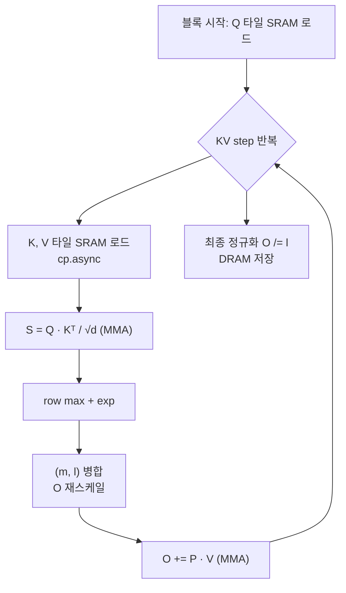

# 11 · Flash Attention — SRAM 타일링 + Online Softmax의 종합예술

> 원본 파일: [`kernels/flash-attn/`](../../kernels/flash-attn/)
> 특히 [`mma/basic/flash_attn_mma_split_q.cu`](../../kernels/flash-attn/mma/basic/flash_attn_mma_split_q.cu) 외 6개 변형.
>
> **핵심 학습 포인트**:
> 1. 일반 Attention의 **O(N²) 메모리 병목**을 **O(N) SRAM-resident** 계산으로 바꾸는 아이디어.
> 2. [05-softmax.md](./05-softmax.md)의 **online softmax 병합 법칙**이 여기서 결정적으로 작동.
> 3. **Split-KV vs Split-Q**: 어느 축을 워프에 나눠주느냐의 근본 선택.
> 4. **Shared QKV SMEM**: 메모리를 공유하여 SRAM 사용량 ¼로 감소, occupancy 상승.

---

## 1. 일반 Attention이 왜 병목인가

Attention 수식:

$$
S = QK^T / \sqrt{d}, \quad P = \mathrm{softmax}(S), \quad O = PV
$$

Shape (single head 기준):
- Q, K, V: `(N, d)` — d는 head_dim, 보통 64~128
- S: `(N, N)` ← ★ 문제의 주범
- P: `(N, N)`
- O: `(N, d)`

**N=8192, d=64** 이면:
- Q, K, V 각각 8192·64·2B = 1 MB (fp16)
- S 크기: 8192·8192·2B = **128 MB** → HBM 대역폭 무자비 소모

전통 구현은 S와 P를 **HBM에 material화**해야 하므로:
- 메모리 대역폭이 가장 먼저 고갈
- 긴 시퀀스에서 OOM

---

## 2. Flash Attention의 핵심 아이디어 (2022)

**S를 메모리에 저장하지 않는다**. 대신:

1. Q, K, V를 **타일 단위로 SRAM**에 올림.
2. K·V의 한 타일이 도착할 때마다 **부분 S, 부분 softmax, 부분 O**를 갱신.
3. 전체 루프 후 O가 완성되고, S/P는 어디에도 저장 안 됨.

**복잡도**:
- 메모리: O(N) (Q, O만 DRAM 유지, S는 SRAM에서 타일씩 생성 후 폐기)
- 연산: O(N²·d) 동일, 하지만 실제 벽시계는 **2~4배 빨라짐** (HBM 트래픽 감소)

### Online Softmax가 열쇠

타일씩 처리하는 순간 "S 전체 max"를 한 번에 못 구함 → **점진적 업데이트** 필요. [05-softmax.md](./05-softmax.md)의 병합 법칙이 그대로 활용:

$$
(m_{new}, d_{new}) = \mathrm{merge}((m_{old}, d_{old}), (m_{tile}, d_{tile}))
$$

O도 함께 갱신:

$$
O_{new} = \frac{d_{old} \cdot e^{m_{old} - m_{new}}}{d_{new}} \cdot O_{old} + \frac{e^{m_{tile} - m_{new}}}{d_{new}} \cdot P_{tile} V_{tile}
$$

(직관: 이전 O는 "옛 스케일"로 정규화돼 있으므로, 새 스케일로 **재스케일링**.)

---

## 3. 알고리즘 의사코드

```python
# 설정: Q, K, V ∈ (N, d). 타일 크기 Br(Q), Bc(KV).
# 각 블록이 한 Q 타일(크기 Br × d)을 담당.

for q_block in Q.split(Br):           # 바깥 루프: 블록 간 병렬
    O_block      = zeros(Br, d)       # SRAM 누산기
    m_block      = -inf * ones(Br)
    l_block      = zeros(Br)

    load_to_SRAM(q_block)             # Q 타일 SRAM 상주

    for kv_step in range(N / Bc):     # 안쪽 루프: 순차 진행
        load_to_SRAM(K[kv_step*Bc : (kv_step+1)*Bc])
        load_to_SRAM(V[kv_step*Bc : (kv_step+1)*Bc])

        # 1. S = Q @ K^T / sqrt(d)     (Br × Bc)
        S_tile = q_block @ K_tile.T / sqrt(d)

        # 2. row-wise max, exp
        m_tile   = rowwise_max(S_tile)
        P_tile   = exp(S_tile - m_tile)
        l_tile   = rowwise_sum(P_tile)

        # 3. 병합: 이전 (m, l)과 합치고 O 재스케일
        m_new = max(m_block, m_tile)
        alpha = exp(m_block - m_new)
        beta  = exp(m_tile  - m_new)
        l_new = alpha * l_block + beta * l_tile

        O_block = alpha * O_block + beta * (P_tile @ V_tile)
        m_block = m_new
        l_block = l_new

    # 4. 마지막 정규화
    O_block = O_block / l_block

    store_to_DRAM(O_block)
```

### 시각화



---

## 4. Split-KV vs Split-Q

원본 README에 설명이 있듯, 워프 간 **어느 축을 나눌지** 선택이 핵심:

### Split-KV (FlashAttention-1 방식)

```
블록 1개 = 여러 워프
각 워프가 KV의 일부 담당 (Bc를 4 등분)

     |     warp 0 (K/V 0~15)    |
     |     warp 1 (K/V 16~31)   |
     |     warp 2 (K/V 32~47)   |
     |     warp 3 (K/V 48~63)   |

문제: softmax 병합 시 워프 간 통신 필요 (SMEM + __syncthreads)
     → 오버헤드 큼
```

### Split-Q (FlashAttention-2, LeetCUDA 권장)

```
블록 1개 = 여러 워프
각 워프가 Q의 일부 담당 (Br를 4 등분), KV는 전체 접근

     | warp_QP 0 | MMA 0 ... MMA 0 (8회) |   ← 워프 0이 Q[0..15] 담당
     | warp_QP 1 | MMA 1 ... MMA 1 (8회) |   ← 워프 1이 Q[16..31]
     | warp_QP 2 | MMA 2 ... MMA 2       |
     | warp_QP 3 | MMA 3 ... MMA 3       |

이점:
  - 각 워프의 softmax 상태 (m, l)가 독립
  - 워프 간 통신 불필요
  - 단, KV SMEM은 모든 워프가 공유 읽기 (문제 없음)
```

이 재편이 **Flash Attention 2**의 주된 기여. LeetCUDA 구현 대부분이 Split-Q 기반.

---

## 5. LeetCUDA의 7개 변형 요약

`kernels/flash-attn/mma/basic/` 에 있는 커널들:

| 파일 | 기법 | SRAM 절약 | 설명 |
|------|------|-----------|------|
| `split_kv.cu` | Split-KV | 1× | FA-1 스타일 (비교용) |
| `split_q.cu` | Split-Q | 1× | FA-2 베이스라인 |
| `share_kv.cu` | Split-Q + K/V 공유 SMEM | **1/2×** | K, V가 같은 SRAM 공간 공유 (순차 로드) |
| `share_qkv.cu` | Split-Q + QKV 공유 SMEM + prefetch Q | **1/4×** | Q를 SRAM→레지스터 prefetch 후 Q SMEM 재사용 |
| `share_qkv_smooth_qkv.cu` | 위 + smooth 로드 | 1/4× | 파이프라인 버블 감소 |
| `tiling_qk.cu` | Split-Q + QK 세분화 타일링 | 유연 | 큰 head_dim 지원 |
| `tiling_qkv.cu` | QKV 세분화 타일링 | 유연 | O(1) SRAM for large d |
| `*_F32F16F16F32.cu` | 위 + fp32 S 누산 | (동일) | 정확도 개선 |

### 핵심 트릭: **"Share QKV SMEM"**

```
전통 (share-kv):
  SMEM: [ Q 타일 ] [ K 타일 ] [ V 타일 ]    → 3× 타일 크기

share-kv:
  SMEM: [ Q 타일 ] [ K/V 번갈아 ]           → 2× 타일 크기
  (K 로드 → 계산 → V 로드 → 계산, 같은 공간 재사용)

share-qkv:
  SMEM: [ Q/K/V 번갈아 ]                    → 1× 타일 크기
  - Q는 바깥 루프 진입 직후 한 번만 로드, 레지스터로 prefetch
  - 이후 SMEM은 K, V 전용으로 순환 사용
```

SRAM 1/4로 축소 → SM당 동시 블록 수 **4배 증가** → occupancy 상승 → 대기시간 숨기기 용이.

### 정확도 변형 — `F32F16F16F32`

S와 O 누산을 fp32로. fp16 MMA 누산은 긴 시퀀스에서 누산 오차 누적 가능 → 수치 민감한 응용(학습 등)에서 F32 누산 선택.

```
MMA 누산 정확도 선택:
  F16F16F16F16 : A=fp16, B=fp16, acc=fp16  → 빠름, 정밀도 위험
  F16F16F16F32 : A=fp16, B=fp16, acc=fp32  → MMA 지원 O
  F32F16F16F32 : S도 fp32로 저장             → 안전, 약간 느림
```

---

## 6. Tile 크기 선택

LeetCUDA 주석에서: `MMA = m16n8k16, Br = 16×4 = 64, Bc = 8×8 = 64`

- `Br = 16·WARP_QP = 16·4 = 64`: Q 타일 길이. 16은 MMA의 M 차원.
- `Bc = 8·WARP_KV = 8·8 = 64`: KV 타일 길이. 8은 MMA의 N 차원.
- `d = 64`: head_dim. K 차원.

**한 블록 처리량** (half):
- Q tile: 64·64·2 = 8 KB
- K tile: 64·64·2 = 8 KB
- V tile: 64·64·2 = 8 KB
- 누산 O tile: 64·64·4 = 16 KB (fp32)
- softmax (m, l): 64·4 = 256 B

SMEM 예산: A100 기준 164 KB/SM. 순박하게 40 KB/블록이면 4 블록/SM까지 → 공유 SMEM 기법으로 더 늘림.

---

## 7. 주요 연산 다이어그램 (한 블록 기준)

```
┌─────────── 블록 (128 스레드 = 4 워프) ───────────┐
│                                                   │
│  SMEM:  ┌──── Q (8KB) ────┐ ┌── K/V (8KB) ──┐   │
│                                                   │
│  반복 kv_step = 0 .. N/Bc-1:                      │
│    ① cp.async K → SMEM                            │
│    ② cp.async.wait_group                          │
│    ③ ldmatrix K → 레지스터                         │
│    ④ mma.sync m16n8k16 × 여러번  →  S 레지스터    │
│    ⑤ row max, row sum(exp)                        │
│    ⑥ online softmax 병합 (m, l, α, β 계산)         │
│    ⑦ O = α·O + β·(P·V)                            │
│       (P는 레지스터 전용, V는 다시 SMEM 경유)      │
│                                                   │
│  최종 O /= l 후 DRAM 저장                          │
└───────────────────────────────────────────────────┘
```

---

## 8. 왜 일반 Attention보다 수 배 빠른가 (정량)

N=8192, d=64 기준:

```
일반 Attention:
  HBM 트래픽 = 2·Q·K·V + 2·S·P  (S, P가 8192² · 2B = 128MB, 읽고 쓰고)
             ≈ 512 MB per head
  FLOP       = 2·N²·d ≈ 8.6 GFLOP

Flash Attention:
  HBM 트래픽 = 2·Q·K·V  (S 없음)
             ≈ 12 MB per head
  FLOP       = 2·N²·d ≈ 8.6 GFLOP  (동일)

  → HBM 트래픽 40× 감소
  → 실제 벽시계 2~4× 가속 (연산이 늘어난 것처럼 보이지만 그만큼 SRAM에서 소화)
```

원 README의 RTX 4090 벤치:
- FA-2 공식: 145 TFLOPS
- LeetCUDA share-qkv+stage2: **221 TFLOPS** (1.5× 더 빠름 — 소규모 attention 한정)

---

## 9. 추가 테크닉: `smooth QKV`, `prefetch Q`, `multi-stage`

- **prefetch Q s2r**: 바깥 루프 시작 직전 Q 타일 전체를 SMEM → 레지스터로 한 번에 끌어올려서 내부 루프 동안 SMEM 접근 제거.
- **multi-stage pipeline**: `cp.async`로 다음 K, V 타일을 current 계산과 오버랩.
- **smooth QKV**: K와 V의 로드 순서를 섞어 SMEM 뱅크 접근을 분산.

각각이 **수 % ~ 10%**의 이득. 모두 조합하면 20~30% 추가 가속.

---

## 10. 한계와 후속 작업 (FFPA)

현재 구현은 **d ≤ 128** 에서 최적. d=256, 512 등 (e.g. LLaMA large) 에서는 SMEM이 부족.

후속 프로젝트 [FFPA](https://github.com/xlite-dev/ffpa-attn) (같은 저자)는:
- **O(1) SRAM** for large head_dim
- 추가적인 fine-grained tiling
- SDPA 대비 1.8~2.1× 가속 (L20, 4090)

이 방향은 현재 최첨단. FlashAttention-3 (Hopper TMA + wgmma 활용)도 동일 계열.

---

## 11. 실무 권고

1. **학습에는 공식 [FlashAttention](https://github.com/Dao-AILab/flash-attention)** 사용. 원저자 말대로 LeetCUDA는 **학습용**.
2. **추론 커스텀 커널**이 필요하면 이 구조를 기반으로 확장.
3. **긴 문맥** (> 32K) 이 중요하면 FlashAttention-3 / FFPA / xformers 최신.

---

## 다음 문서

👉 [12-swizzle.md](./12-swizzle.md) — MMA 최적화의 마지막 퍼즐. XOR 기반 SMEM 주소 변환으로 **뱅크 충돌 제로, SMEM 용량 낭비 제로**.
