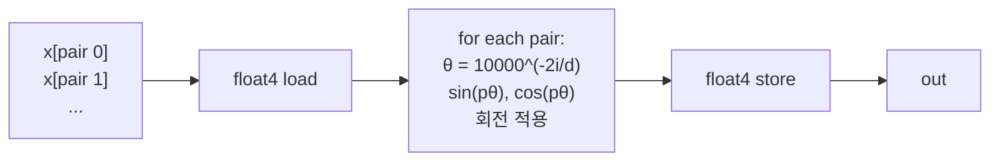

# 15 · RoPE — Rotary Position Embedding

> 원본 파일: [`kernels/rope/rope.cu`](../../kernels/rope/rope.cu)
>
> **핵심 학습 포인트**:
> 1. RoPE는 위치 정보를 **(x[2i], x[2i+1])** 쌍 단위로 2D 회전 적용하는 elementwise 연산.
> 2. `sin/cos` 계산을 inline으로 — constant 테이블 사용 여부의 트레이드오프.
> 3. LLaMA, GPT-NeoX 이후 Transformer 표준. Attention의 Q, K에 적용.

---

## 1. 수학 배경

한 토큰의 hidden 벡터 `x ∈ R^d`를 **쌍 단위**로 2D 회전:

각 쌍 `(x[2i], x[2i+1])` 에 대해, 주파수 `θ_i = 10000^{-2i/d}` 와 위치 `p` (토큰 인덱스)로 회전각 `pθ_i` 적용:

$$
\begin{pmatrix} \tilde{x}_{2i} \\ \tilde{x}_{2i+1} \end{pmatrix}
= \begin{pmatrix} \cos(p\theta_i) & -\sin(p\theta_i) \\ \sin(p\theta_i) & \cos(p\theta_i) \end{pmatrix}
\begin{pmatrix} x_{2i} \\ x_{2i+1} \end{pmatrix}
$$

**직관**: 차원 쌍마다 다른 "회전 속도". 저차원(i 작음)은 빨리 회전, 고차원은 천천히. 내적에서 **상대 위치**가 자연스럽게 나타나도록 설계.

### 왜 쌍 단위?

- 짝수 차원 전제 (d가 2의 배수).
- 2D 회전 행렬의 **길이 보존성**: `|(x̃_0, x̃_1)| = |(x_0, x_1)|` — norm 불변.
- 내적에서 `<RoPE_p(q), RoPE_k(k)> = f(q, k, p-k)` 형태로 **상대 위치만 남음**.

---

## 2. 기본 구현 (v1)

`rope.cu:20-33`:

```cuda
__global__ void rope_f32_kernel(float *x, float *out, int seq_len, int N) {
  int idx = blockIdx.x * blockDim.x + threadIdx.x;

  // idx는 "쌍 index": 스레드 하나가 한 쌍 처리
  float x1 = x[idx * 2];
  float x2 = x[idx * 2 + 1];

  int token_pos = idx / N;   // p
  int token_idx = idx % N;   // i (dimension pair index)

  float exp_v = 1.0f / powf(theta, 2 * token_idx / (N * 2.0f));  // θ_i
  float sin_v = sinf(token_pos * exp_v);                          // sin(pθ_i)
  float cos_v = cosf(token_pos * exp_v);                          // cos(pθ_i)

  float out1 = x1 * cos_v - x2 * sin_v;
  float out2 = x1 * sin_v + x2 * cos_v;

  out[idx * 2]     = out1;
  out[idx * 2 + 1] = out2;
}
```

### 중요한 점 몇 가지

**`theta = 10000.0f`**: RoFormer 논문 표준. LLaMA도 같음. 긴 컨텍스트 모델은 `theta=500000` 등으로 증가 (long-context extrapolation).

**`N`의 의미**: 파일에선 변수명이 `N`인데, 이는 **쌍의 개수 per token** = `d/2`. `token_pos`와 `token_idx` 분해를 위해 인자로 받음.

**`powf`는 느림**: 매 스레드가 `powf` 1회, `sinf` 1회, `cosf` 1회. 고주파 호출. 큰 배치에선 이것이 **연산의 병목**이 될 수 있음.

### 최적화 여지: sin/cos 캐시

실제 프로덕션에서는:
1. `sin/cos` 테이블을 **precompute** (shape `(seq_len, d/2)`, 두 테이블).
2. Kernel은 단순히 테이블 lookup + 곱셈.
3. 메모리 bound로 바뀌지만 `sinf/cosf` 대비 훨씬 빠름.

LeetCUDA 본 버전은 **교육 목적**으로 inline 계산.

---

## 3. 인덱싱 방식 변형 (v2)

`rope.cu:36-48`:

```cuda
__global__ void rope_f32_v2_kernel(float *x, float *out, int seq_len, int N) {
  int token_pos = blockIdx.x;      // ★ 블록 = 토큰
  int tid       = threadIdx.x;     // ★ 스레드 = 쌍 인덱스
  float x1 = x[token_pos * N * 2 + tid * 2];
  float x2 = x[token_pos * N * 2 + tid * 2 + 1];
  // ... 나머지 동일
}
```

### v1 vs v2 차이

| 버전 | 블록 매핑 | 장단점 |
|------|----------|--------|
| v1 | grid stride, 1 쌍/스레드 | N 제약 없음, 하지만 rank 계산 필요 |
| v2 | 1 블록 = 1 토큰, tid = 쌍 index | 코드 간결, block 수 = seq_len |

v2가 더 "per-token" 개념과 맞고 보통 선호됨.

---

## 4. float4 pack 변형

`rope.cu:50-68`:

```cuda
int idx = blockIdx.x * blockDim.x + threadIdx.x;
float4 x_v = FLOAT4(x[idx * 4]);   // 쌍 2개 = 4 float 로드

int token_pos = idx / N;
int token_idx = idx % N;

// 쌍마다 다른 θ
float exp_f_v = 1.0f / powf(theta, 2 * token_idx * 2 / (N * 4.0f));
float exp_s_v = 1.0f / powf(theta, 2 * (token_idx * 2 + 1) / (N * 4.0f));
// ...
```

- 한 스레드가 2쌍 = float4 처리.
- `powf/sinf/cosf`는 쌍마다 **따로** 계산 — 각 쌍이 다른 i를 가지므로.
- 로드/스토어는 `FLOAT4` 합체.

### 이득

- 메모리 이슈 절반.
- ALU도 균등 분산 (초월함수를 더 많이 하지만 총 쌍 수는 동일).

---

## 5. 적용 위치 (컨텍스트)

RoPE는 **Q, K에 적용, V에는 미적용**:

```
Q = RoPE(Wq · x, pos)
K = RoPE(Wk · x, pos)
V = Wv · x                 ← 회전 없음

S = Q @ K^T / sqrt(d)     → 회전이 내적에서 "상대 위치" 정보를 생성
```

실전 LLM에선 이 커널을 **Attention 직전**에 Q, K 각각 한 번씩 호출.

### Flash Attention과의 결합

일부 최적화는 Q, K를 **RoPE와 attention을 퓨전**해서 별도 커널 호출 없이 처리 — [11-flash-attn](./11-flash-attn.md) 변형에서 가능.

---

## 6. 수치 안정성

긴 컨텍스트(seq_len > 4K)에서:
- `token_pos * exp_v` 값이 큰 경우 `sinf/cosf`는 여전히 정확 (주기 함수).
- 다만 `powf`는 매우 작은 수(고주파 차원)에서 오차 누적 가능.
- 실제로는 **precompute cache**가 수치적으로 더 안정적.

---

## 7. 요약 다이어그램



---

## 다음 문서

👉 [16-nms.md](./16-nms.md) — 완전히 다른 분야: **객체 검출의 NMS**. 상호 의존적 연산의 CUDA 구현.
