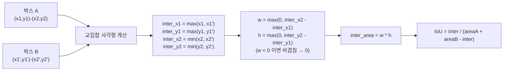

# 16 · NMS — Non-Maximum Suppression

> 원본 파일: [`kernels/nms/nms.cu`](../../kernels/nms/nms.cu)
>
> **핵심 학습 포인트**:
> 1. **상호 의존적 연산**을 CUDA에서 다루는 방식.
> 2. IoU(Intersection-over-Union) 계산의 벡터화.
> 3. 본 구현의 **순차 의존성** 한계와 프로덕션 구현과의 차이.

---

## 1. 문제 정의

객체 검출(object detection)의 후처리:

```
입력: 박스 N개 + 각 박스의 점수
처리: 점수 내림차순 정렬 후, 점수 높은 박스부터 "비슷한 박스"를 폐기
출력: 살아남은 박스 인덱스
```

"비슷한" 기준: **IoU > threshold** (보통 0.5).

### IoU 정의

두 박스 A, B의 교집합 / 합집합:

$$
\mathrm{IoU}(A, B) = \frac{|A \cap B|}{|A \cup B|} = \frac{\text{inter}}{\text{area}_A + \text{area}_B - \text{inter}}
$$

IoU = 1이면 완전 일치, 0이면 비겹침.

### 전형적 시나리오

```
객체 1개 주변에 박스 10개 겹쳐 검출됨:
  [●] [●] [●] [●] [●]   ← 모두 같은 객체 주변
  점수  0.95  0.93  0.9  0.89  0.85

NMS 이후:
  [●]                    ← 점수 0.95 하나만 남음
```

---

## 2. 본 구현의 구조

`nms.cu`의 전체 플로우 (`nms.cu:71-101`):

```python
# (CPU/Python 레이어)
1. scores.sort(desc=True) → order_t
2. boxes_sorted = boxes[order_t]
3. nms_kernel<<<grid, block>>>(boxes_sorted, ...)
4. keep → CPU 다운로드
5. keep == 1 인 인덱스만 수집해 반환
```

### 정렬 사전 처리 이유

점수 내림차순으로 정렬하면, **자기보다 앞의 박스**만 살펴보면 됩니다:
- 앞에 IoU 큰 박스가 있다 → 나는 폐기.
- 앞에 그런 박스가 없다 → 내가 대표.

---

## 3. 커널 본체

`nms.cu:15-59`:

```cuda
__global__ void nms_kernel(const float *boxes, const float *scores, int *keep,
                           int num_boxes, float iou_threshold) {
  const int idx = blockIdx.x * blockDim.x + threadIdx.x;
  if (idx >= num_boxes) return;

  // 내 박스 좌표 로드
  float x1 = boxes[idx * 4 + 0];
  float y1 = boxes[idx * 4 + 1];
  float x2 = boxes[idx * 4 + 2];
  float y2 = boxes[idx * 4 + 3];

  // 자기보다 점수 높은 박스들(i < idx)을 모두 확인
  for (int i = 0; i < idx; ++i) {
    if (keep[i] == 0) continue;                    // 이미 폐기된 건 skip
    // i번 박스 좌표 로드
    float x1_i = boxes[i * 4 + 0];
    // ...

    // 교집합 사각형
    float inter_x1 = max(x1, x1_i);
    float inter_y1 = max(y1, y1_i);
    float inter_x2 = min(x2, x2_i);
    float inter_y2 = min(y2, y2_i);
    float inter_w = max(0.0f, inter_x2 - inter_x1);
    float inter_h = max(0.0f, inter_y2 - inter_y1);
    float inter_area = inter_w * inter_h;

    // 합집합 = A + B - 교집합
    float area   = (x2 - x1) * (y2 - y1);
    float area_i = (x2_i - x1_i) * (y2_i - y1_i);
    float iou = inter_area / (area + area_i - inter_area);

    if (iou > iou_threshold) {
      keep[idx] = 0;                              // ★ 폐기
      return;
    }
  }
  keep[idx] = 1;                                  // 살아남음
}
```

### 스레드 매핑

- **1 스레드 = 1 박스**.
- 각 스레드가 **자기보다 앞의 모든 박스와 비교** → 평균 `O(N)` 연산/스레드.
- 총 연산 `O(N²)` 을 `N` 스레드로 분산 → 시간복잡도 `O(N)` (이상적).

---

## 4. 본 구현의 한계 — 경쟁 조건

### 문제

```
스레드 idx=100 이 돌면서 i=50까지 갔을 때:
  keep[50]을 읽으려 함

그런데 스레드 idx=50이 아직 안 끝나서 keep[50]이 **미정** 상태일 수 있음!
```

CUDA는 **스레드 순서 보장 없음**. 스레드 50이 100보다 늦게 실행될 수 있어 **race condition** 가능.

### 이 구현이 작동하는 이유 (조건부)

`keep[]` 배열이 처음에 초기값(아마 0 또는 undefined)이라면:
- `keep[i] == 0 → skip` 이 "아직 미결정"을 "폐기"로 오인.
- 결과 박스가 **과도하게 폐기**될 가능성.

실용적으로는 `nms.cu:78` 에서 `torch::empty`로 만든 `keep`은 미초기화 → 운 나쁘면 쓰레기 값.

### 프로덕션 구현은 다르다

Torchvision의 NMS는 **IoU 매트릭스 + bitmask**:

```
1. 블록 단위로 N×N IoU 매트릭스의 일부 타일 계산
2. 각 블록은 64×64 = 4096 IoU를 bit로 압축 (64비트 × 64 = 512B)
3. CPU에서 bitmask를 받아 그리디 선택

장점: 스레드 간 의존성 없음, 완전 병렬
단점: N² 메모리 필요 (큰 N에서 비효율)
```

LeetCUDA 본 구현은 **학습 목적의 간이 버전**. 실전 사용 금지.

---

## 5. IoU 계산 세부



### 중요 포인트: `max(0.0, ...)`

교집합이 없으면 `inter_x2 < inter_x1`이 되어 음수. 이때 0으로 clamp하지 않으면 **음수 면적**이 곱해져 IoU가 음수가 됨. 이 clamp가 빠지는 실수가 흔함.

---

## 6. 배치 NMS와 최적화

### Batched NMS

배치마다 독립적으로 NMS를 돌려야 함. 해법:
- **class-aware offset**: 각 클래스마다 좌표를 큰 값만큼 시프트 → 다른 클래스와 IoU가 자연스럽게 0.
- 한 번에 전체 배치를 NMS.

### 병렬 프렌들리 대안

- **Soft NMS**: 폐기 대신 점수 감쇠. Relu 형태 또는 Gaussian.
- **Matrix NMS** (SOLO 등): 완전 병렬, 한 번의 행렬 계산.
- **DIoU/GIoU NMS**: IoU 대신 distance-aware 지표.

---

## 7. 실무에서 NMS가 병목이 될 때

보통 detection 모델은 `N ~ 1000` 박스 수준이라 NMS 자체가 빠름. 하지만:
- 비디오 실시간 + 다중 카메라 환경
- 밀집한 장면 (`N > 10000`)
- 모바일/엣지 추론

이런 경우 GPU NMS 대신 **CPU에서 스트림 처리**가 더 빠를 수도 있습니다. 측정 후 선택.

---

## 8. 요약

| 측면 | 특성 |
|------|------|
| 메모리 패턴 | 2차 접근 (모든 i < idx) |
| 재사용 | 본 박스 좌표는 레지스터에, 타 박스는 매번 로드 |
| 의존성 | 순차 보장 없음 — race condition 위험 |
| 병렬도 | 이론상 높으나 실제 결과 재현성 불안 |
| 프로덕션 권장 | Torchvision nms / CUB sort + 별도 마스킹 |

---

## 다음 문서

👉 [17-transformer.md](./17-transformer.md) — **fusion의 예술**. LayerNorm + QKV + Attention + FFN + residual을 한 커널로?
